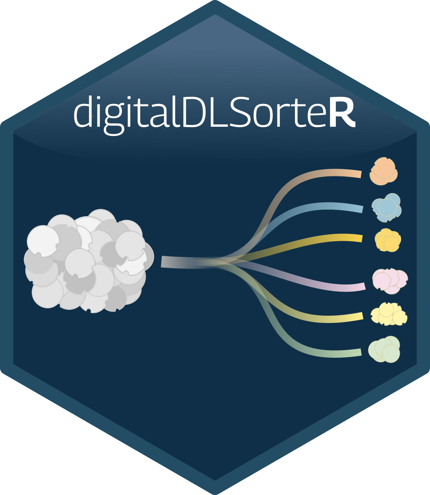
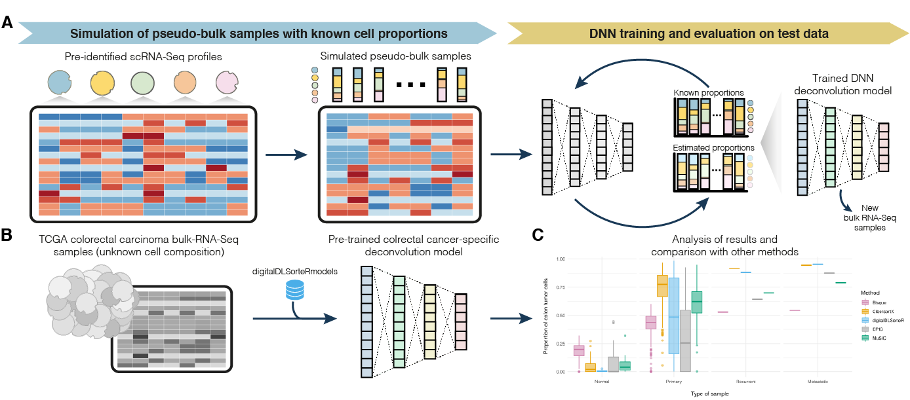

# **digitalDLSorteR** 

[](https://github.com/diegommcc/digitalDLsorteR/actions) 

<div style="text-align:left">
<span>
<h4>An R package to deconvolute bulk RNA-seq from scRNA-seq data based on Neural Networks</h4></span>
</div>

<br>

The **digitalDLSorteR** R package provides a set of tools to deconvolute cell type proportions of bulk RNA-seq data through the development of context-specific deconvolution models based on single-cell RNA-seq (scRNA-seq) data. These models are able to accurately estimate cell type proportions of bulk RNA-seq samples from specific biological environments. For more details about the algorithm and the functionalities implemented in this package, see [Torroja and Sanchez-Cabo, 2019](https://www.frontiersin.org/articles/10.3389/fgene.2019.00978/full), [Mañanes et al., 2024](https://academic.oup.com/bioinformatics/article/40/2/btae072/7609037), and <https://diegommcc.github.io/digitalDLSorteR/>.




## Installation

**digitalDLSorteR** is available on CRAN and can be installed as follows:

```r
install.packages("digitalDLSorteR")
```

The version under development is available on GitHub:

```r
if (!requireNamespace("remotes", quietly = TRUE))
    install.packages("remotes")
remotes::install_github("diegommcc/digitalDLSorteR")
```

The package depends on the [tensorflow](https://cran.r-project.org/package=tensorflow) R package, so a working Python interpreter with the Tensorflow Python library installed is needed. The `installTFpython` function provides an easy way to install a conda environment called `digitaldlsorter-env` with all necessary dependencies covered. We recommend installing the TensorFlow Python library in this way, although a custom installation is possible. See the [Keras/TensorFlow installation and configuration](<https://diegommcc.github.io/digitalDLSorteR/articles/kerasIssues.html>) article of the package website for more details.


```r
library("digitalDLSorteR")
installTFpython(install.conda = TRUE)
```

## Rationale of **digitalDLSorteR**

The algorithm consists of training Deep Neural Network (DNN) models with simulated bulk RNA-seq samples whose cell composition is known. These pseudo-bulk RNA-seq samples are generated by aggregating pre-characterized scRNA-seq data from specific biological environments. These models are able to accurately deconvolute new bulk RNA-seq samples from the same environment, as they are able to account for possible environmental-dependent transcriptional changes of specific cells, such as immune cells in complex diseases (e.g., specific subtypes of cancer or atherosclerosis). This aspect overcomes this limitation present in other methods. For instance, in the case of immune cells, published methods often rely on purified transcriptional profiles from peripheral blood mononuclear cells despite the fact that these cells are highly variable depending on environmental conditions. Thus, this feature together with the fact that scRNA-seq datasets improve over time (the more cells, the more variability learnt by the models) will lead to build more accurate and comprehensive models. 

## Usage

The package has two main ways of use:

1. Using pre-trained models included in the **digitalLDSorteRmodels** (<https://github.com/diegommcc/digitalDLSorteRmodels>) R package to deconvolute new bulk RNA-seq samples from the same environment. So far, the available models allow to deconvolute samples from human breast cancer ([GSE75688](https://www.ncbi.nlm.nih.gov/geo/query/acc.cgi?acc=GSE75688) data from [Chung et al., 2017](https://www.nature.com/articles/ncomms15081) used as reference), and colorectal cancer ([GSE132465](https://www.ncbi.nlm.nih.gov/geo/query/acc.cgi?acc=GSE132465), [GSE132257](https://www.ncbi.nlm.nih.gov/geo/query/acc.cgi?acc=GSE132257) and [GSE144735](https://www.ncbi.nlm.nih.gov/geo/query/acc.cgi?acc=GSE144735) data from [Lee, Hong, Etlioglu Cho et al., 2020](https://www.nature.com/articles/s41588-020-0636-z) used as reference). For more details about this workflow, please see the [Using pre-trained context-specific deconvolution models](https://diegommcc.github.io/digitalDLSorteR/articles/pretrainedModels.html) article. **Disclaimer**: these models intend to be a quick option to deconvolute samples from the same biological environment, but we strongly recommend generating new models with data manually curated by the users.
2. Building new deconvolution models from pre-characterized scRNA-seq datasets. This is the main way to use **digitalDLSorteR**. For more information on the workflow, see the article [Building new deconvolution models](https://diegommcc.github.io/digitalDLSorteR/articles/newModels.html).

To use pre-trained context specific deconvolution models, **digitalDLSorteR** relies on the **digitalDLSorteRmodels** data R package. Therefore, it should be installed along with **digitalDLSorteR** from GitHub as follows:

```r
remotes::install_github("diegommcc/digitalDLSorteRmodels")
```

Once **digitalDLSorteRmodels** is loaded, the pre-trained models are available. See the article [Using pre-trained context-specific deconvolution models](https://diegommcc.github.io/digitalDLSorteR/articles/pretrainedModels.html) for an example.

## Final remarks

* Regarding pre-trained models, if you generate new models and want to make them available through the **digitalDLSorteRmodels** R package for other users to use them, contact with us!
* We provide some pre-trained models that take into account genes that seem to be relevant for these environmental conditions. However, as these genes might be different depending on the bulk RNA-seq to be deconvoluted, we strongly recommend creating new models through the workflow explained [here](). 
* Contributions and suggestions are welcome!

## Citation 

Please, if you use **digitalDLSorteR** in your research, cite [Torroja and Sanchez-Cabo, 2019](https://www.frontiersin.org/articles/10.3389/fgene.2019.00978/full) (first description of the algorithm) and [Mañanes et al., 2024](https://academic.oup.com/bioinformatics/article/40/2/btae072/7609037) (version for spatial transcriptomics data whose development has served to improve **digitalDLSorteR** as well). 

## References

<table>
  <tr><td>Chung, W., Eum, H. H., Lee, H. O., Lee, K. M., Lee, H. B., Kim, K. T., et al. (2017). Single-cell RNA-seq enables comprehensive tumour and immune cell profiling in primary breast cancer.
  <i>Nat. Commun.</i>
  <b>8</b> (1) 15081
  <a href='https://doi.org/10.1038/ncomms15081'>doi:10.1038/ncomms15081</a>
  </td></tr>

  <tr><td>Li, H., Courtois, E. T., Sengupta, D., Tan, Y., Chen, K. H., Goh, J. J. L., et al. (2017). Reference component analysis of single-cell transcriptomes elucidates cellular heterogeneity in human colorectal tumors.
  <i>Nat. Genet.</i>
  <b>49</b> (5), 708-718
  <a href='https://doi.org/10.1038/ng.3818'>doi:10.1038/ng.3818</a>
  </td></tr>

  <tr><td>Torroja, C. and Sánchez-Cabo, F. (2019). digitalDLSorter: A Deep Learning algorithm to quantify immune cell populations based on scRNA-seq data.
  <i>Frontiers in Genetics</i>
  <b>10</b> 978
  <a href='https://doi.org/10.3389/fgene.2019.00978'>doi:10.3389/fgene.2019.00978</a>
  </td></tr>
  
    <tr><td> Mañanes, D., Rivero-García, I., Relaño, C., Jimenez-Carretero, D., Torres, M., Sancho, D., Torroja, C. and Sánchez-Cabo, F. (2024). SpatialDDLS: An R package to deconvolute spatial transcriptomics data using neural networks.
  <i>Bioinformatics</i>
   <b>40</b> 2
  <a href='https://doi.org/10.1093/bioinformatics/btae072'>doi:10.1093/bioinformatics/btae072</a>
  </td></tr>
  
</table>
