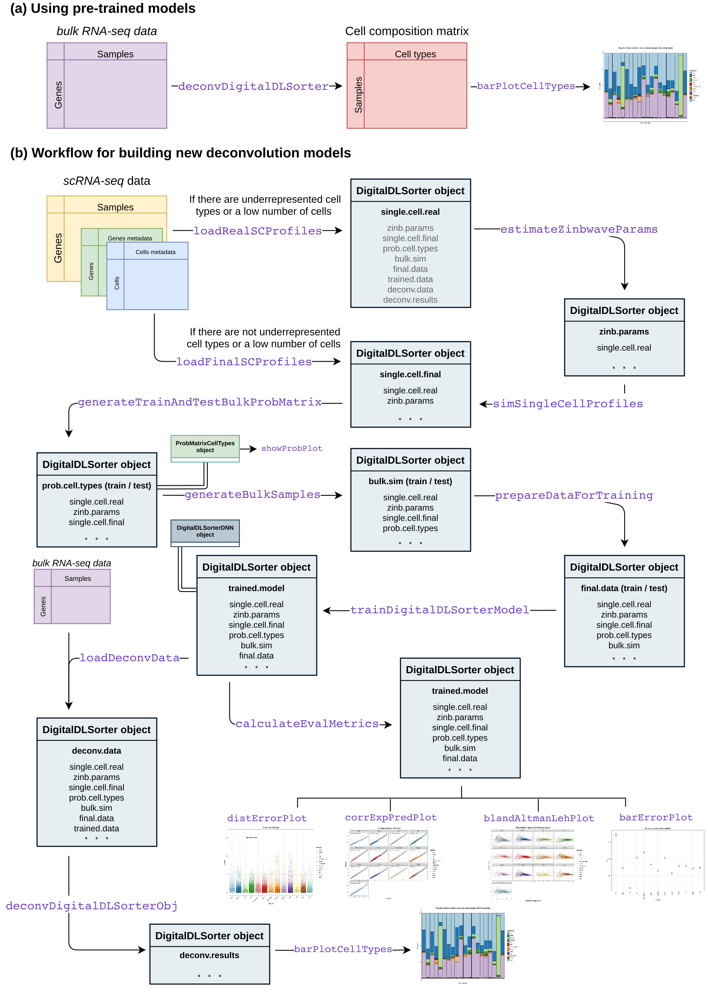

# **digitalDLSorteR** 

[](https://github.com/diegommcc/digitalDLsorteR/actions) 
[](https://app.codecov.io/gh/diegommcc/digitalDLSorteR)


<div style="text-align:left">
<span>
<h4>An R package to deconvolute bulk RNA-Seq from scRNA-Seq data based on Deep Learning</h4></span>
</div>

<br>

The **digitalDLSorteR** R package provides a set of tools to deconvolute and infer cell type proportions of bulk RNA-Seq data through the development of context-specific deconvolution models based on Deep Learning and single-cell RNA-Seq (scRNA-Seq) data. These models are able to accurately enumerate and quantify cell proportions of bulk RNA-Seq samples from specific biological environments. For more details about the algorithm and the functionalities implemented in this package, see [Torroja and Sanchez-Cabo, 2019](https://www.frontiersin.org/articles/10.3389/fgene.2019.00978/full) and <https://diegommcc.github.io/digitalDLSorteR/>.


## Installation

**digitalDLSorteR** can be installed from GitHub, but will soon be available at CRAN.

```r
if (!requireNamespace("devtools", quietly = TRUE))
    install.packages("devtools")
devtools::install_github("diegommcc/digitalDLSorteR")
```

It depends on [tensorflow](https://cran.r-project.org/package=tensorflow) R package, so a working Python interpreter with the Tensorflow Python library installed is needed. The `installTFpython` function provides an easy way to install a conda environment called `digitaldlsorter-env` with all the needed dependencies covered. We recommend installing TensorFlow Python library in this way, although a custom installation is possible. See the article [Keras/TensorFlow installation and configuration](<https://diegommcc.github.io/digitalDLSorteR/articles/kerasIssues.html>) of the package's website for more details.


```r
library("digitalDLSorteR")
installTFpython(install.conda = TRUE)
```


## Rationale of **digitalDLSorteR**

This algorithm consists of training Deep Neural Network (DNN) models with simulated bulk RNA-Seq samples whose cell composition is known. These pseudo-bulk RNA-Seq samples are generated by aggregating pre-characterized scRNA-Seq data from specific biological environments. These models are able to accurately deconvolute new bulk RNA-Seq samples from the same environment since they are able to consider possible environmental-dependent transcriptional changes of specific cells, such as macrophages or other immune cells in complex diseases (e.g., specific subtypes of cancer or atherosclerosis). This aspect allows to overcome this limitation present in other methods. For instance, in the case of immune cells, published methods usually rely on purified transcriptional profiles of peripheral blood mononuclear cells despite the fact these cells are highly variable depending on the enviromental conditions. Therefore, considering this feature together with the use of powerful DNN models and the fact that improvement of scRNA-Seq datasets over time will lead to build more accurate models, **digitalDLSorteR** offers a good alternative to classical methods based on linear models with pre-defined markers and unreliable transcriptional references.

## Usage

The package has two main ways of usage:

1. Using pre-trained models included in the **digitalLDSorteRmodels** (<https://github.com/diegommcc/digitalDLSorteRmodels>) R package to deconvolute new bulk RNA-Seq samples from the same environment. So far, the available models allow to deconvolute samples from human breast cancer ([GSE75688](https://www.ncbi.nlm.nih.gov/geo/query/acc.cgi?acc=GSE75688) data from [Chung et al., 2017](https://www.nature.com/articles/ncomms15081) used as reference), and colorectal cancer ([GSE81861](https://www.ncbi.nlm.nih.gov/geo/query/acc.cgi?acc=GSE81861) data from [Li et al., 2017](https://www.nature.com/articles/ng.3818) used as reference). For more details about this workflow, please see the article [Using pre-trained context-specific deconvolution models](https://diegommcc.github.io/digitalDLSorteR/articles/pretrainedModels.html). Moreover, it is summarized in the panel A of the figure below.
2. Building new deconvolution models from pre-characterized scRNA-Seq datasets. This workflow involves some requirements regarding computational resources, although **digitalDLSorteR** has been developed to provide with all the possible facilities to make the process easier, such as batch processing of data and the use of the [HDF5Array](https://bioconductor.org/packages/release/bioc/html/HDF5Array.html) and [DelayedArray](https://bioconductor.org/packages/release/bioc/html/DelayedArray.html) R packages to use HDF5 files as back-end. The main steps are summarized in the panel B of the figure below, but for more information about the workflow, see the article [Building new deconvolution models](https://diegommcc.github.io/digitalDLSorteR/articles/newModels.html).



To use pre-trained context specific deconvolution models, **digitalDLSorteR** depends on **digitalDLSorteRmodels** data package as it makes them available. Therefore, it should be installed together with **digitalDLSorteR** if this functionality wants to be used. To do so, it can be installed from GitHub using devtools:

```r
if (!requireNamespace("digitalDLSorteRmodels", quietly = TRUE)) {
  devtools::install_github("diegommcc/digitalDLSorteRmodels")
}
```

Once **digitalDLSorteRmodels** is loaded, the pre-trained models are available. See the article [Using pre-trained context-specific deconvolution models](https://diegommcc.github.io/digitalDLSorteR/articles/pretrainedModels.html) for some examples.

In addition, some examples and the vignettes of **digitalDLSorteR** make use of pre-computed datasets from the **digitalDLSorteRdata** package. If you want to inspect these pre-computed _DigitalDLSorter_ objects, you can install it from GitHub using devtools as follows. See [Performance of a real model: deconvolution of colorectal cancer samples](https://diegommcc.github.io/digitalDLSorteR/articles/realModelExample.html) for an example.

```r
if (!requireNamespace("digitalDLSorteRdata", quietly = TRUE)) {
  devtools::install_github("diegommcc/digitalDLSorteRdata")
}
```

## Final remarks

* Regarding available pre-trained models, new models coming soon! Of course, you can build your own models and even contribute to **digitalDLSorteR** making them available. Contact us to incude them in the package!
* The pre-trained context-specific deconvolution models are available in the **digitalDLSorteRmodels** R package (<https://github.com/diegommcc/digitalDLSorteRmodels>)
* The used data for examples and the vignette are available in the **digitalDLSorteRdata** R package (<https://github.com/diegommcc/digitalDLSorteRdata>)
* Report bugs at <https://github.com/diegommcc/digitalDLSorteR/issues>
* Contributions and suggestions are welcome!

## References

<table>
  <tr><td>Chung, W., Eum, H. H., Lee, H. O., Lee, K. M., Lee, H. B., Kim, K. T., et al. (2017). Single-cell RNA-Seq enables comprehensive tumour and immune cell profiling in primary breast cancer.
  <i>Nat. Commun.</i>
  <b>8</b> (1) 15081
  <a href='https://doi.org/10.1038/ncomms15081'>doi:10.1038/ncomms15081</a>
  </td></tr>

  <tr><td>Li, H., Courtois, E. T., Sengupta, D., Tan, Y., Chen, K. H., Goh, J. J. L., et al. (2017). Reference component analysis of single-cell transcriptomes elucidates cellular heterogeneity in human colorectal tumors.
  <i>Nat. Genet.</i>
  <b>49</b> (5), 708-718
  <a href='https://doi.org/10.1038/ng.3818'>doi:10.1038/ng.3818</a>
  </td></tr>

  <tr><td>Torroja, C. and Sánchez-Cabo, F. (2019). digitalDLSorter: A Deep Learning algorithm to quantify immune cell populations based on scRNA-Seq data.
  <i>Frontiers in Genetics</i>
  <b>10</b> 978
  <a href='https://doi.org/10.3389/fgene.2019.00978'>doi:10.3389/fgene.2019.00978</a>
  </td></tr>
</table>
