**digitalDLSorteR** implements all the necessary tools to build new context-specific deconvolution models from  previously characterized scRNA-Seq data. Taking into account the variability of some cell types depending on the context in which they are found, we aim to generate different specific models for each environment. From our point of view, this opens a door to more accurate and specific models instead of using generic transcriptional profiles as a reference as, for instance, in the case of peripheral blood mononuclear cell (PBMC) to estimate the proportions of tumor-infiltrating lymphocytes in cancer settings. In this vignette, this workflow is going to be shown using a 'toy' example with data from the **digitalDLSorteRdata** package (<https://github.com/diegommcc/digitalDLSorteRdata>), but the performance of a real model can be explored in [Performance of a real model: deconvolution of colorectal cancer samples](realModelExample.html) vignette.

This workflow is more computationally expensive than using pre-trained models, so we recommend building new models if you want to deconvolute samples from an unavailable model or in case you think your scRNA-Seq data provide a better picture of this environment than the ones already used in this package. In any case, **digitalDLSorteR** provides a set of functionalities that make this process easier and computationally cheaper in terms of RAM usage: batch processing of data and the use of the [HDF5Array](https://bioconductor.org/packages/release/bioc/html/HDF5Array.html) and [DelayedArray](https://bioconductor.org/packages/release/bioc/html/DelayedArray.html) packages (see [HDF5 files as back-end](hdf5Backend.html) vignette for more information). Furthermore, all steps are centralized in the `DigitalDLSorter` S4-class, the core of **digitalDLSorteR**, in order to provide a good user-experience and keep all the generated information tidy in the same object.


```r
## loading the packages
suppressMessages(library(digitalDLSorteR))
# if digitalDLSOrteRdata is not installed
if (!requireNamespace("digitalDLSorteRdata", quietly = TRUE)) {
  install.packages(
    "digitalDLSorteRdata", 
    repos = "https://diegommcc.github.io/digitalDLSorteRdataRepo/"
  )
}
suppressMessages(library(digitalDLSorteRdata))
## loading data for examples
data(DDLSChung.list)
DDLSChung <- listToDDLS(DDLSChung.list)
## take SingleCellExperiment object from DigitalDLSorter object
sceObj <- single.cell.real(DDLSChung)
sceObj
```

```
## class: SingleCellExperiment 
## dim: 18751 22 
## metadata(0):
## assays(1): counts
## rownames(18751): A1BG A1CF ... ZYX ZZEF1
## rowData names(3): ensembl_gene_id external_gene_name gene_length
## colnames(22): BC09_31 BC07LN_26 ... BC09_42 BC07_03
## colData names(10): Cell_ID Patient ... res.FINAL Cell_type
## reducedDimNames(0):
## mainExpName: NULL
## altExpNames(0):
```


The main steps needed to build new models are summarized as follows, although you can see a visual summary in the figure below.

1. [Loading data in a `DigitalDLSorter` object](#load)
2. [Oversampling of single-cell profiles (optional)](#oversample)
4. [Generation of cell composition matrix of pseudo-bulk RNA-Seq samples](#cell-prop)
5. [Stimulation pseudo-bulk RNA-Seq samples with known cell composition](#simul-bulk)
6. [Deep Neural Network training and evaluation](#dnn)
7. [Evaluation of deconvolution model on test data: visualization of results](#eval)
8. [Loading and deconvolution of new bulk RNA-Seq samples](#new-bulk)
9. [Saving `DigitalDLSorter` object and trained models](#save)


### Loading data into a `DigitalDLSorter` object {#load}

First, we have to load the scRNA-Seq data into a `DigitalDLSorter` object. This S4-class contains all the slots needed to store the different data generated during the building of new deconvolution models. The information to be provided consists of three elements: 

* Counts matrix: a matrix with genes as rows and cells as columns.
* Cells metadata: a table with annotations (columns) for each cell (rows). The expected information in this data frame are a column with the ID used for each cell, a column with the corresponding cell types, and metadata that could be used as covariates in the following steps (gender, sample type...).
* Genes metadata with annotations (columns) for each gene (rows). In the same way that cells metadata, this data frame must contain the notation used for each gene in counts matrix and other covariates such as gene length, GC content, etc. 

This information may come from a pre-loaded `SingleCellExperiment` object or from files stored on disk. For the latter, tsv, tsv.gz, sparse matrices (mtx) and HDF5 files (h5) formats are accepted. Finally, the data will be stored as a `SingleCellExperiment` object in the `single.cell.real` slot of the new `DigitalDLSorter` object. To do this, the `loadSCProfiles` function is used as follows: 


```r
DDLSToy <- loadSCProfiles(
  single.cell = sceObj, # SingleCellExperiment object
  cell.ID.column = "Cell_ID",
  gene.ID.column = "external_gene_name",
  min.cells = 0,
  min.counts = 0,
  project = "ToyExampleBreast"
)
DDLSToy
```

```
## An object of class DigitalDLSorter 
## Real single-cell profiles:
##   18751 features and 22 cells
##   rownames: AC007381.1 OR2M3 NLRP1 ... NLRP1 FGD2 HMBOX1 ZNF575 
##   colnames: BC07LN_26 BC09_Re_62 BC04_49 ... BC04_49 BC07LN_29 BC03LN_91 BC04_07 
## Project: ToyExampleBreast
```

In this case, we are loading the single-cell profiles from a `SingleCellExperiment` object, but it could be done using files directly as follows: 


```r
## this code will not be run
toyFiles <- c("countsMatrix.tsv.gz", 
              "cellsMetadata.tsv.gz",
              "genesMetadata.tsv.gz")

DDLSToy <- loadSCProfiles(
  single.cell = toyFiles, 
  cell.ID.column = "Cell_ID",
  gene.ID.column = "external_gene_name",
  min.cells = 0, min.counts = 0,
  project = "ToyExampleBreast"
)
```

In the documentation, you can see all the parameters that `loadSCProfiles` offers to preprocess loaded data, such as `min.counts` and `min.cells`, `fun.aggregate`, etc. In addition, in the case of using very large scRNA-Seq datasets as input, **digitalDLSorteR** allows using HDF5 files as back-end to handle data that don't fit in RAM using the [HDF5Array](https://bioconductor.org/packages/release/bioc/html/HDF5Array.html) and [DelayedArray](https://bioconductor.org/packages/release/bioc/html/DelayedArray.html) packages. We only recommend their use in actual cases of very large datasets. HDF5 files, in spite of being very useful for dealing with RAM problems, make processes much slower. As an example, the following code chunk would create an HDF5 file in which these single-cell data would be stored, allowing you to work on them without loading them all into RAM. See the documentation for more details.


```r
DDLSToy <- loadSCProfiles(
  single.cell = toyFiles, cell.ID.column = "Cell_ID",
  gene.ID.column = "external_gene_name",
  min.cells = 0, min.counts = 0,
  file.backend = "singlecell_data.h5",
  project = "ToyExampleBreast"
)
```


### Oversampling of single-cell profiles {#oversample}

**digitalDLSorteR** offers the possibility to simulate new single-cell profiles from real ones in order to increase signal and variability in small datasets or when under-represented cell types are present. This step is optional but recommended in case you have any of these situations. The `estimateZinbwaveParams` and `simSCProfiles` functions are used for this purpose. 

#### Estimating of ZINB-WaVE model parameters to simulate new single-cell profiles {#zinb}

The first step is to estimate a set of parameters that fits the real single-cell data in order to simulate new realistic single-cell profiles. We selected the ZINB-WaVE framework [@Risso2018] that estimates the parameters of a ZINB (zero-inflated negative binomial) distribution. It was chosen because of its ability to accommodate not only the variability within a particular cell type but also the variability within the whole experiment. 

This process is performed by the `estimateZinbwaveParams` function, which makes use of the [splatter](https://bioconductor.org/packages/release/bioc/html/splatter.html) package, a wrapper of the original [zinbwave](https://bioconductor.org/packages/release/bioc/html/zinbwave.html) package. You must specify the column corresponding to cell types in cells metadata, and other cell/gene covariates can be added based on your experimental design such as patient, gender or gene length. This process can take a few minutes to run because it is not highly optimized in the original packages, so be patient. For this vignette, the ZINB-WaVE model has been pre-loaded from the **digitalDLSorteRdata** package to avoid run times. In any case, you can adjust the number of threads used in some steps during the estimation with `threads` argument depending on your computational resources. It is carried out by the [BiocParallel](https://www.bioconductor.org/packages/release/bioc/html/BiocParallel.html) package. In the case of large datasets with some under-represented cell types, `subset.cells` parameter allows to make a subset of cells to increase the speed of the process.


```r
## this code is not going to be run
DDLSToy <- estimateZinbwaveParams(
  object = DDLSToy,
  cell.ID.column = "Cell_ID",
  gene.ID.column = "external_gene_name",
  cell.type.column = "Cell_Type",
  cell.cov.columns = "Patient",
  gene.cov.columns = "gene_length",
  threads = 1,
  verbose = TRUE
)
```


```r
DDLSToy
```

```
## An object of class DigitalDLSorter 
## Real single-cell profiles:
##   18751 features and 22 cells
##   rownames: RASSF8-AS1 SLC39A10 SLC12A7 ... SLC12A7 CD72 SNN TRABD 
##   colnames: BC07LN_54 BC07_42 BC03_86 ... BC03_86 BC09_Re_07 BC09_42 BC03LN_62 
## ZinbParams object:
##   22 samples;   18751 genes.
##   21 sample-level covariate(s) (mu);   21 sample-level covariate(s) (pi);
##   2 gene-level covariate(s) (mu);   2 gene-level covariate(s) (pi);
##   0 latent factor(s).
## Project: ToyExampleBreast
```


#### Simulating new single-cell profiles from the estimated parameters {#simul-sc}

Once the ZINB-WaVE parameters have been estimated, the `simSCProfiles` function uses them to simulate new single-cell profiles based on the real ones. It is done by randomly sampling from a negative binomial distribution with the estimated ZINB parameters $\mu$ and $\theta$, and introducing dropouts by sampling from a binomial distribution with the estimated probability $\pi$. You must specify the number of cell profiles per cell type that will be generated (`n.cells`). For example, if your data set is composed of 13 cell types and `n.cells` is equal to 10, the number of simulated profiles will be 130. 


```r
DDLSToy <- simSCProfiles(
  object = DDLSToy,
  cell.ID.column = "Cell_ID",
  cell.type.column = "Cell_type",
  n.cells = 10,
  suffix.names = "_Simul",
  verbose = TRUE
)
```

```
## === Get parameters from model:
```

```
##     - mu: 22, 18751
```

```
##     - pi: 22, 18751
```

```
##     - Theta: 18751
```

```
## === Selected cell type(s) from ZINB-WaVE model (13 cell type(s)):
```

```
##     - Bmem
##     - DC
##     - ER+
##     - ER+ and HER2+
##     - HER2+
##     - Macrophage
##     - Monocyte
##     - Stromal
##     - TCD8
##     - Tme
##     - TNBC
##     - Treg
##     - BGC
```

```
## === Simulated matrix dimensions:
```

```
##     - n (cells): 130
```

```
##     - J (genes): 18751
```

```
##     - i (# entries): 2437630
```

```
## 
## DONE
```

These simulated single-cell profiles are stored in `single.cell.simul` slot to be used to simulate new bulk RNA-Seq profiles with a known cell composition.


```r
DDLSToy
```

```
## An object of class DigitalDLSorter 
## Real single-cell profiles:
##   18751 features and 22 cells
##   rownames: AC011523.1 NBEA YDJC ... YDJC AL139407.1 AC124312.3 KRT7-AS 
##   colnames: BC07LN_29 BC01_02 BC03LN_91 ... BC03LN_91 BC03_86 BC03_11 BC09_42 
## ZinbParams object:
##   22 samples;   18751 genes.
##   21 sample-level covariate(s) (mu);   21 sample-level covariate(s) (pi);
##   2 gene-level covariate(s) (mu);   2 gene-level covariate(s) (pi);
##   0 latent factor(s).
## Simulated single-cell profiles:
##   18751 features and 130 cells
##   rownames: SUCO AC104695.4 DEGS2 ... DEGS2 CDC42BPB ACAD9 ATG10 
##   colnames: Macrophage_Simul55 Stromal_Simul77 Macrophage_Simul53 ... Macrophage_Simul53 TCD8_Simul87 TCD8_Simul86 Tme_Simul91 
## Project: ToyExampleBreast
```

In this step, it is also possible to store the new simulated single-cell profiles in a HDF5 file. Indeed, they can be simulated by batch, avoiding to load all data into RAM. The code would be as follows: 


```r
DDLSToy <- simSCProfiles(
  object = DDLSToy,
  cell.ID.column = "Cell_ID",
  cell.type.column = "Cell_type",
  n.cells = 10,
  suffix.names = "_Simul",
  file.backend = "simulated_singlecell_data.h5",
  block.processing = TRUE,
  block.size = 20, # number of single-cell profiles simulated per batch
  verbose = TRUE
)
```


### Generation of the cell composition matrix of pseudo-bulk RNA-Seq samples {#cell-prop}

To simulate pseudo-bulk samples with a known cell composition, it is needed to generate a cell composition matrix that determines the proportion of each cell type in each sample. This is carried out by the `generateBulkCellMatrix` function that stores these results in the `prob.cell.types` slot as a `ProbMatrixCellTypes` object.

This process starts with the single-cell profiles being divided into training and test data (see `train.freq.cells` argument in the documentation). Each subset will be used to generate each subset of bulk samples (training and test) in order to avoid any distortion of the results during model evaluation. Then, the proportions are generated by six different methods to avoid biases during training due to the cellular composition of the simulated bulk RNA-Seq samples:

1. Cell proportions are randomly sampled from a truncated uniform distribution with predefined limits according to _a priori_ knowledge of the abundance of each cell type (see `prob.design` argument). This information can be inferred from the single cell analysis itself or from the literature.
2. A second set is generated by randomly permuting cell type labels from a distribution generated by the previous method.
3. Cell proportions are randomly sampled as by method 1 without replacement.
4. Using the last method to generate proportions, cell types labels are randomly sampled.
5. Cell proportions are randomly sampled from a Dirichlet distribution.
6. Pseudo-bulk RNA-Seq samples composed of the same cell type are generated in order to provide 'pure' pseudo-bulk samples.

The proportion of each sample type in the total of samples can be modified by the `proportion.train` and `proportion.test` arguments. Moreover, `prob.zero` controls the number of zeros (number of cell types that will be zero in each sample) in each method. This parameter was introduced because otherwise cell compositions that are strongly biased toward a certain cell type or missing specific cell types would be rare in training subset. To account for this, `prob.zero` generate sparse compositions depending on the probability introduced for each method. Finally, another important parameter is `n.cells` which determines the number of cells that will compose each pseudo-bulk sample, and `num.bulk.samples`, which defines the total number of pseudo-bulk samples generated (training + test subsets). The code would be as follows:


```r
## prior knowledge for prob.design argument
probMatrix <- data.frame(
  Cell_type = c("Monocyte", "Tme", "Bmem", "TCD8", "BGC", 
                "Treg", "Macrophage", "DC", "Stromal", 
                "TNBC", "HER2+", "ER+ and HER2+", "ER+"),
  from = c(rep(1, 8), 1, rep(30, 4)),
  to = c(rep(15, 8), 50, rep(70, 4))
)

DDLSToy <- generateBulkCellMatrix(
  object = DDLSToy,
  cell.ID.column = "Cell_ID",
  cell.type.column = "Cell_type",
  prob.design = probMatrix,
  num.bulk.samples = 250,
  n.cells = 100,
  verbose = TRUE
)
```

```
## 
## === The number of bulk RNA-Seq samples that will be generated is equal to 250
```

```
## 
## === Training set cells by type:
```

```
##     - Bmem: 8
##     - DC: 9
##     - ER+: 7
##     - ER+ and HER2+: 4
##     - HER2+: 9
##     - Macrophage: 10
##     - Monocyte: 6
##     - Stromal: 6
##     - TCD8: 7
##     - Tme: 8
##     - TNBC: 11
##     - Treg: 6
##     - BGC: 10
```

```
## === Test set cells by type:
```

```
##     - Bmem: 4
##     - DC: 2
##     - ER+: 4
##     - ER+ and HER2+: 8
##     - HER2+: 6
##     - Macrophage: 1
##     - Monocyte: 5
##     - Stromal: 5
##     - TCD8: 4
##     - Tme: 4
##     - TNBC: 2
##     - Treg: 5
##     - BGC: 1
```

```
## === Probability matrix for training data:
```

```
##     - Bulk RNA-Seq samples: 167
##     - Cell types: 13
```

```
## === Probability matrix for test data:
```

```
##     - Bulk RNA-Seq samples: 83
##     - Cell types: 13
```

```
## DONE
```


```r
DDLSToy
```

```
## An object of class DigitalDLSorter 
## Real single-cell profiles:
##   18751 features and 22 cells
##   rownames: SUGCT ZNF282 FKBP7 ... FKBP7 APOBEC3B RAB11FIP5 CXCL11 
##   colnames: BC09_31 BC04_07 BC03_11 ... BC03_11 BC07_03 BC07LN_26 BC04_11 
## ZinbParams object:
##   22 samples;   18751 genes.
##   21 sample-level covariate(s) (mu);   21 sample-level covariate(s) (pi);
##   2 gene-level covariate(s) (mu);   2 gene-level covariate(s) (pi);
##   0 latent factor(s).
## Simulated single-cell profiles:
##   18751 features and 130 cells
##   rownames: RFPL3S DZIP1 ABCC9 ... ABCC9 IQGAP2 CPEB2-DT IRF2 
##   colnames: Monocyte_Simul70 Stromal_Simul77 Monocyte_Simul63 ... Monocyte_Simul63 Bmem_Simul1 Monocyte_Simul62 BGC_Simul123 
## Cell type composition matrices:
##   Cell type matrix for traindata: 167 bulk samples and 13 cell types 
##   Cell type matrix for testdata: 83 bulk samples and 13 cell types 
## Project: ToyExampleBreast
```

Remember that this is a 'toy' example. In real circumstances, depending on the number of single-cell profiles loaded/simulated at the begining and the computational resources, about 20,000-30,000 samples would be recommended.

You can inspect the cell composition matrix created in this step with the getter function `getProbMatrix`:


```r
head(getProbMatrix(DDLSToy, type.data = "train"))
```

```
##        Monocyte Tme Bmem TCD8 BGC Treg Macrophage DC Stromal TNBC HER2+ ER+ and HER2+ ER+
## Bulk_1        4   1    3    4   5    2          3  2      13   18    19            13  13
## Bulk_2        0   6    0    3   4    5          4  0       8   18    17            17  18
## Bulk_3        3   6    2    3   4    4          0  3      11   14    15            15  20
## Bulk_4        3   0    0    7   6    0          0 10      19    0    55             0   0
## Bulk_5        5   5    2    4   0    3          3  0       6   19    18            18  17
## Bulk_6        2   6    0    0   0    1          0  0      11   21    20            16  23
```

```r
tail(getProbMatrix(DDLSToy, type.data = "train"))
```

```
##          Monocyte Tme Bmem TCD8 BGC Treg Macrophage DC Stromal TNBC HER2+ ER+ and HER2+ ER+
## Bulk_162        0   0    0    0   0    0          0  0       0    0   100             0   0
## Bulk_163        0   0    0    0   0    0          0  0       0    0   100             0   0
## Bulk_164        0   0    0    0   0    0          0  0       0    0     0           100   0
## Bulk_165        0   0    0    0   0    0          0  0       0    0     0           100   0
## Bulk_166        0   0    0    0   0    0          0  0       0    0     0             0 100
## Bulk_167        0   0    0    0   0    0          0  0       0    0     0             0 100
```

Moreover, the generated distributions can be plotted using the `showProbPlot` function:


```r
lapply(
  1:6, function(x) {
    showProbPlot(
      DDLSToy, type.data = "train", set = x, type.plot = "boxplot"
    )
  }
)
```

```
## [[1]]
```

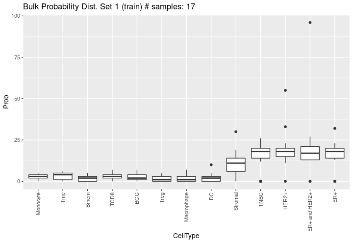

```
## 
## [[2]]
```

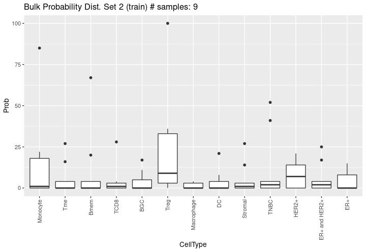

```
## 
## [[3]]
```

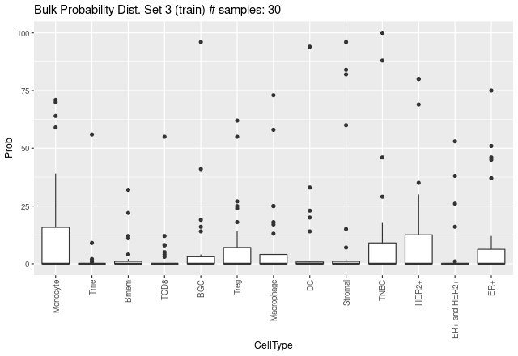

```
## 
## [[4]]
```

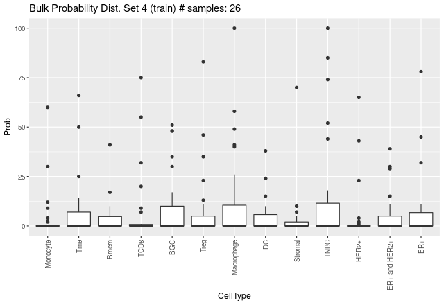

```
## 
## [[5]]
```

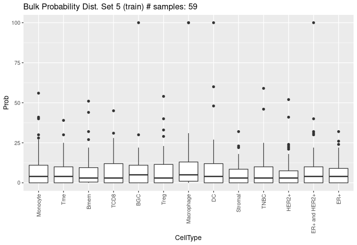

```
## 
## [[6]]
```

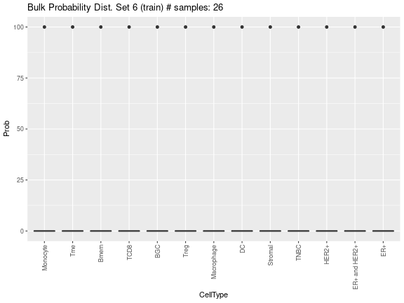

### Simulation of pseudo-bulk RNA-Seq samples with known cell composition {#simul-bulk}

Now, the simulated cell proportions are used to simulate the pseudo-bulk samples. They are simulated by aggregating single-cell profiles of each cell type according to these proportions. The idea is to simulate a real bulk RNA-Seq data in which the gene expression levels of each cell are aggregated into a single sample. Therefore, this expression matrix will be generated according to the following equation:

\begin{equation}
  T_{ij} = \sum_{k = 1}^{K} \sum_{z = 1}^Z C_{izk} 
\end{equation}

\begin{equation*}
  \textrm{such as} \left\{
\begin{array}{l}
  i = 1 \ldots M;\\
  j = 1 \ldots N \\
  Z = 1 \ldots \textrm{n.cells} \cdot P_{kj} \\
  \sum_{k = 1}^K Z \cdot P_{kj} = \textrm{n.cells}
\end{array}
\right.  
\end{equation*}

where $T_{ij}$ is the expression level of gene $i$ in bulk sample $j$; $C_{izk}$ is the expression level of gene $i$ in cell $z$ in bulk sample $j$; and $P_{kj}$ is the proportion of cell type $k$ in bulk sample $j$ (the cell composition matrix generated in the previous step). $Z$ represents the number of cells that will make up the proportion of cell type $k$ in the bulk sample $j$ and corresponds to the `n.cells` parameter from the `generateBulkCellMatrix` function. The cells are randomly sampled based on their cell type and how they were split into training and test subsets. This step is performed by `simBulkProfiles` as follows:


```r
DDLSToy <- simBulkProfiles(object = DDLSToy, type.data = "both")
```

```
## === Set parallel environment to 1 thread(s)
```

```
## 
## === Generating train bulk samples:
```

```
## 
## === Generating test bulk samples:
```

```
## 
## DONE
```

These samples are stored as a `SummarizedExperiment` object in the `bulk.simul` slot where they can be inspected at any time:


```r
DDLSToy
```

```
## An object of class DigitalDLSorter 
## Real single-cell profiles:
##   18751 features and 22 cells
##   rownames: FYCO1 AC141930.1 SRP14-AS1 ... SRP14-AS1 SPP2 PPT2-EGFL8 APPBP2 
##   colnames: BC07_18 BC09_Re_62 BC04_07 ... BC04_07 BC04_33 BC05_84 BC04_49 
## ZinbParams object:
##   22 samples;   18751 genes.
##   21 sample-level covariate(s) (mu);   21 sample-level covariate(s) (pi);
##   2 gene-level covariate(s) (mu);   2 gene-level covariate(s) (pi);
##   0 latent factor(s).
## Simulated single-cell profiles:
##   18751 features and 130 cells
##   rownames: HNRNPH3 MLH1 KRT78 ... KRT78 AIMP2 HMGB2 CHAF1A 
##   colnames: TNBC_Simul108 Bmem_Simul3 TCD8_Simul89 ... TCD8_Simul89 Stromal_Simul74 HER2+_Simul47 Monocyte_Simul68 
## Cell type composition matrices:
##   Cell type matrix for traindata: 167 bulk samples and 13 cell types 
##   Cell type matrix for testdata: 83 bulk samples and 13 cell types 
## Simulated bulk samples:
##   train bulk samples:
##     18751 features and 167 samples
##     rownames: TRABD2A GPSM2 COQ10A ... COQ10A EIF4E1B P2RY6 MON2 
##     colnames: Bulk_70 Bulk_165 Bulk_60 ... Bulk_60 Bulk_77 Bulk_54 Bulk_7 
##   test bulk samples:
##     18751 features and 83 samples
##     rownames: C9ORF78 CIAO1 DNAJC18 ... DNAJC18 LAMTOR1 TBCD AC109454.2 
##     colnames: Bulk_5 Bulk_2 Bulk_3 ... Bulk_3 Bulk_35 Bulk_9 Bulk_6 
## Project: ToyExampleBreast
```

Again, these pseudo-bulk samples can be stored as an HDF5 file. This is the most recommended step of **digitalDLSorteR** to use this functionality, as it is the most computationally expensive part of the package and these samples will only be accessed during training and evaluation of the Deep Neural Network (DNN) model. As in `simSCProfiles`, the samples can be simulated by batch and also a desired number of threads can be used: 


```r
DDLSToy <- simBulkProfiles(
  object = DDLSToy, 
  type.data = "both", 
  file.backend = "pseudobulk_samples.h5",
  block.processing = TRUE,
  block.size = 1000, 
  threads = 2
)
```


### Training and evaluation of the Deep Neural Network {#dnn}

Once the pseudo-bulk samples have been generated, the DNN model can be trained and evaluated. `trainDigitalDLSorterModel` is the function in charge of both steps and uses the [keras](https://cran.r-project.org/package=keras) package with [tensorflow](https://cran.r-project.org/package=tensorflow) as back-end. If you want more information about [keras](https://cran.r-project.org/package=keras) or experience any problems during its installation, please see [Keras/TensorFlow installation and configuration](kerasIssues.html) vignette.

In terms of architecture and model parameters, `trainDigitalDLSorterModel` implements two hidden layers with 200 neurons each by default, although any of these parameters can be changed through the `trainDigitalDLSorterModel` parameters. Moreover, for a more customized model, it is possible to provide a pre-built model in the `custom.model` parameter. See the documentation for more details. 

The code with the default parameters is as follows: 


```r
DDLSToy <- trainDigitalDLSorterModel(object = DDLSToy)
```

```
## === Training and test from stored data was selected
```

```
## Model: "DigitalDLSorter"
## ________________________________________________________________________________________________________________________________
## Layer (type)                                             Output Shape                                       Param #             
## ================================================================================================================================
## Dense1 (Dense)                                           (None, 200)                                        3750400             
## ________________________________________________________________________________________________________________________________
## BatchNormalization1 (BatchNormalization)                 (None, 200)                                        800                 
## ________________________________________________________________________________________________________________________________
## ActivationReLu1 (Activation)                             (None, 200)                                        0                   
## ________________________________________________________________________________________________________________________________
## Dropout1 (Dropout)                                       (None, 200)                                        0                   
## ________________________________________________________________________________________________________________________________
## Dense2 (Dense)                                           (None, 200)                                        40200               
## ________________________________________________________________________________________________________________________________
## BatchNormalization2 (BatchNormalization)                 (None, 200)                                        800                 
## ________________________________________________________________________________________________________________________________
## ActivationReLu2 (Activation)                             (None, 200)                                        0                   
## ________________________________________________________________________________________________________________________________
## Dropout2 (Dropout)                                       (None, 200)                                        0                   
## ________________________________________________________________________________________________________________________________
## Dense3 (Dense)                                           (None, 13)                                         2613                
## ________________________________________________________________________________________________________________________________
## BatchNormalization3 (BatchNormalization)                 (None, 13)                                         52                  
## ________________________________________________________________________________________________________________________________
## ActivationSoftmax (Activation)                           (None, 13)                                         0                   
## ================================================================================================================================
## Total params: 3,794,865
## Trainable params: 3,794,039
## Non-trainable params: 826
## ________________________________________________________________________________________________________________________________
```

```
## 
## === Training DNN with 268 samples:
```

```
## 
## === Evaluating DNN in test data (134 samples)
```

```
##    - loss: 0.6292
##    - accuracy: 0.6119
##    - mean_absolute_error: 0.0535
##    - categorical_accuracy: 0.6119
```

```
## 
## === Generating prediction results using test data
```

```
## DONE
```

At the end, `DDLSToy` will contain a `DigitalDLSorterDNN` object with all the information associated with the model in the `trained.model` slot: a `keras.engine.sequential.Sequential` object with the trained model, the metrics and loss function histories during training, and the prediction results on test data.


```r
DDLSToy
```

```
## An object of class DigitalDLSorter 
## Real single-cell profiles:
##   18751 features and 22 cells
##   rownames: ALOX5 P2RX1 NOL9 ... NOL9 AP000356.2 RESF1 NDUFAF3 
##   colnames: BC09_31 BC07LN_29 BC07LN_26 ... BC07LN_26 BC03_43 BC04_07 BC04_33 
## ZinbParams object:
##   22 samples;   18751 genes.
##   21 sample-level covariate(s) (mu);   21 sample-level covariate(s) (pi);
##   2 gene-level covariate(s) (mu);   2 gene-level covariate(s) (pi);
##   0 latent factor(s).
## Simulated single-cell profiles:
##   18751 features and 130 cells
##   rownames: SLC43A3 BRI3 KRT6B ... KRT6B ZYG11A AP003068.1 DLEU1 
##   colnames: ER+ and HER2+_Simul33 DC_Simul14 Monocyte_Simul69 ... Monocyte_Simul69 Treg_Simul120 Monocyte_Simul62 ER+_Simul27 
## Cell type composition matrices:
##   Cell type matrix for traindata: 167 bulk samples and 13 cell types 
##   Cell type matrix for testdata: 83 bulk samples and 13 cell types 
## Simulated bulk samples:
##   train bulk samples:
##     18751 features and 167 samples
##     rownames: SMARCA5 AL592148.3 AC022144.1 ... AC022144.1 ZNF800 SEPSECS DNAH10 
##     colnames: Bulk_61 Bulk_122 Bulk_40 ... Bulk_40 Bulk_53 Bulk_48 Bulk_104 
##   test bulk samples:
##     18751 features and 83 samples
##     rownames: CSK OXCT1-AS1 SLC2A4RG ... SLC2A4RG MRPS30 TNFRSF10B AP003557.2 
##     colnames: Bulk_35 Bulk_60 Bulk_76 ... Bulk_76 Bulk_50 Bulk_75 Bulk_34 
## Trained model: 10 epochs
##   Training metrics (last epoch):
##     loss: 0.3069
##     accuracy: 0.8313
##     mean_absolute_error: 0.04
##     categorical_accuracy: 0.8313
##   Evaluation metrics on test data:
##     loss: 0.6292
##     accuracy: 0.6119
##     mean_absolute_error: 0.0535
##     categorical_accuracy: 0.6119 
## Project: ToyExampleBreast
```

As this is a 'toy' example, results are not very accurate. For a real example of a well trained model, see the [Performance of a real model: deconvolution of colorectal cancer samples](realModelExample.html) vignette.

#### `on.the.fly` argument

The `on.the.fly` argument from `trainDigitalDLSorterModel` allows to generate pseudo-bulk samples used for training and testing 'on the fly'. This means that it is possible to skip the simulation of pseudo-bulk samples performed by the `simBulkProfiles` function, and create samples at the same time as the DNN model is being trained. Of course, the runtimes during training may increase, but in this way data is not loaded into RAM or stored in large HDF5 files. To use this functionality, it is only necessary to set `on.the.fly = TRUE` as follows:


```r
DDLSToy <- trainDigitalDLSorterModel(object = DDLSToy, on.the.fly = TRUE)
```

### Evaluation of the deconvolution model on test data: visualization of results {#eval}

Although the metrics from the prediction results on test data are informative about the performance of the model, a more comprehensive analysis is needed. For this task, **digitalDLSorteR** provides a set of visualization functions to represent a variety of error metrics in different ways.

First, `calculateEvalMetrics` is needed to calculate the error metrics to be plotted. By default, the absolute error (`AbsErr`), the proportional absolute error (`ppAbsErr`), the squared error (`SqrErr`) and the proportional squared error (`ppSqrErr`) are calculated for each sample of test data. In addition, they are all aggregated using their average values according to three criteria: each cell type (`CellType`), proportion bins of 0.1 (`pBin`) and number of different cell types (`nCellTypes`).


```r
DDLSToy <- calculateEvalMetrics(object = DDLSToy)
```

Now, these results can ve plotted by the following battery of functions.

#### `distErrorPlot` and `barErrorPlot`: error distributions {#dist-err}

The `distErrorPlot` function allows to plot how errors are distributed in different ways. Moreover, it allows to split the charts in different panels representing how the errors are distributed by a determined variable. The available variables are cell types (`CellType`) and number of cell types present in the samples (`nCellTypes`). In the following example, we will represent the overall errors by cell types.


```r
distErrorPlot(
  DDLSToy,
  error = "AbsErr",
  x.by = "CellType",
  color.by = "CellType", 
  error.labels = FALSE, 
  type = "boxplot",
  size.point = 1
)
```

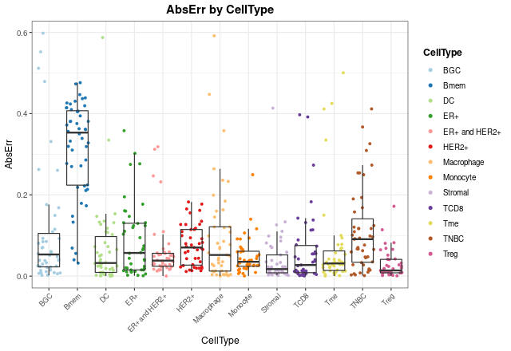

Now, if you want to know if there is a bias toward a specific cell type, yo can use `facet.by` parameter to split the plot by cell type:


```r
distErrorPlot(
  DDLSToy,
  error = "AbsErr",
  facet.by = "CellType",
  color.by = "nCellTypes", 
  type = "violinplot",
  size.point = 1
)
```

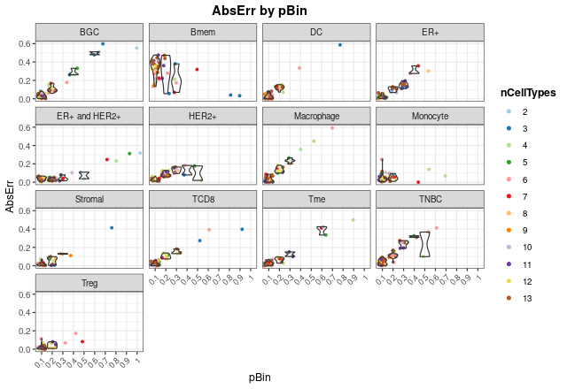

It is also possible to represent errors by number of different cell types in the samples: 


```r
distErrorPlot(
  DDLSToy,
  error = "AbsErr",
  color.by = "CellType", 
  facet.by = "nCellTypes",
  type = "boxplot",
  size.point = 1
)
```

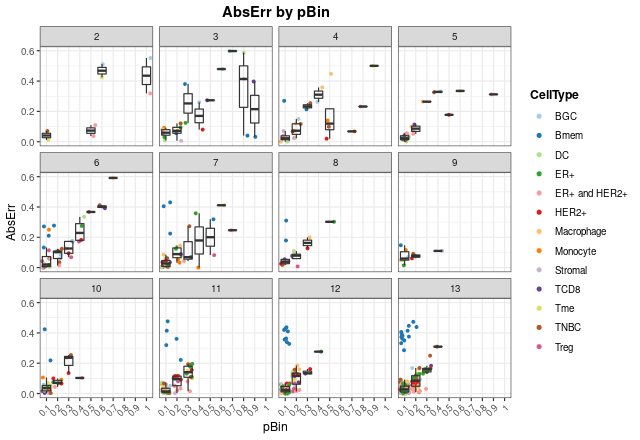

Finally, with `barErrorPlot`, the mean error values with their corresponding dispersion ranges can be plotted:


```r
barErrorPlot(DDLSToy, error = "MAE", by = "CellType")
```


#### `corrExpPredPlot`: correlation plots between predicted and expected proportions {#corr-err}

Ideally, the model should provide predictions that linearly match the actual proportions. Therefore, you can generate correlations plots to assess the model. By default, the Pearson's coefficient correlation ($R$) and the concordance correlation coefficient (CCC) are shown as annotations on the plots. The latter is a more realistic measure as it decreases as the points move away from the identity.


```r
corrExpPredPlot(
  DDLSToy,
  color.by = "CellType",
  size.point = 1,
  corr = "both"
)
```

```
## `geom_smooth()` using formula 'y ~ x'
```

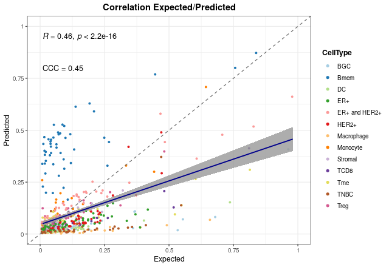

As in the previous case, the charts can be split according to different variables. Now, let's split results by `CellType` and `nCellTypes` as an example:


```r
corrExpPredPlot(
  DDLSToy,
  color.by = "CellType",
  facet.by = "CellType",
  size.point = 1, 
  filter.sc = F,
  corr = "both"
)
```

```
## `geom_smooth()` using formula 'y ~ x'
```

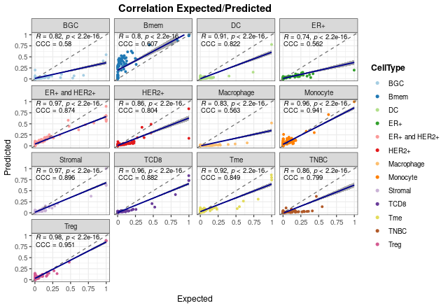


```r
corrExpPredPlot(
  DDLSToy,
  color.by = "CellType",
  facet.by = "nCellTypes",
  size.point = 1,
  corr = "both"
)
```

```
## `geom_smooth()` using formula 'y ~ x'
```

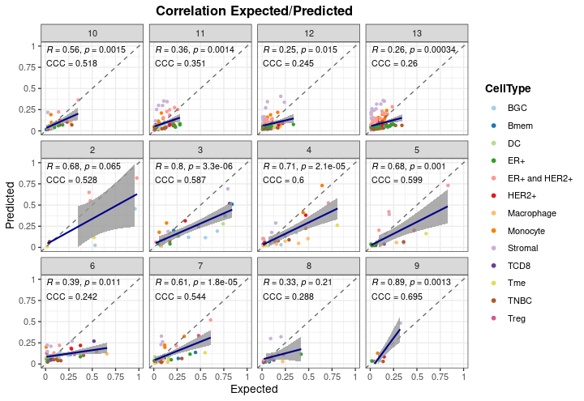


#### `blandAltmanLehPlot`: Bland-Altman agreement plots {#bland-err}

The `blandAltmanLehPlot` function allows to display Bland-Altman agreement plots. This is a kind of graphical method for comparing the level of agreement between two different sets of values. The differences between the predictions and the actual proportions are plotted against their means. The central dashed line represents the mean difference, while the two red dashed lines are the limits of agreement, which are defined as the mean difference plus and minus 1.96 times the standard deviation of the differences. 95% of the differences are expected to fall between these two limits, so the wider the margins, the worse the performance. It is also possible to show it in $log_2$ space.


```r
blandAltmanLehPlot(
  DDLSToy, 
  color.by = "CellType",
  log.2 = FALSE,
  size.point = 1,
  filter.sc = TRUE,
  density = TRUE,
)
```

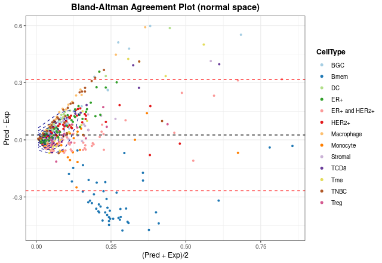

In addition, this function has the same behaviour as the previous ones, as it is possible to split the plots:


```r
blandAltmanLehPlot(
  DDLSToy, 
  color.by = "nCellTypes",
  facet.by = "nCellTypes",
  log.2 = FALSE,
  size.point = 1,
  filter.sc = TRUE,
  density = FALSE
)
```

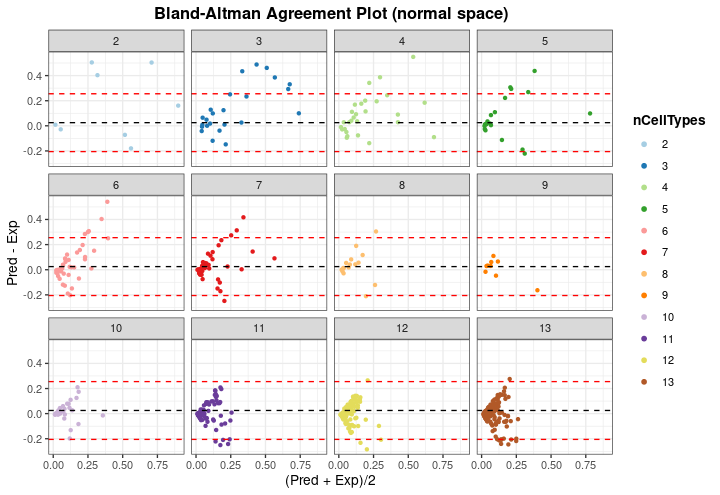


### Loading new bulk RNA-Seq samples to deconvolute them {#new-bulk}

Once the model has been evaluated, new bulk RNA-seq data can be loaded into the object to be deconvoluted:


```r
suppressMessages(library(SummarizedExperiment, quietly = TRUE))
se.TCGA <- SummarizedExperiment(assay = list(counts = TCGA.breast.small))

DDLSToy <- loadDeconvData(
  object = DDLSToy,
  data = se.TCGA, 
  name.data = "TCGA.breast"
)
```

Then, with the `deconvDigitalDLSorterObj` function, these new samples can be deconvoluted into the cell types considered by the model and the predicted proportions can be represented by the `barPlotCellTypes` function. The cell composition matrix is stored in the `deconv.results` slot.


```r
DDLSToy <- deconvDigitalDLSorterObj(
  object = DDLSToy, 
  name.data = "TCGA.breast",
  verbose = FALSE
)
barPlotCellTypes(DDLSToy, name.data = "TCGA.breast", rm.x.text = TRUE)
```

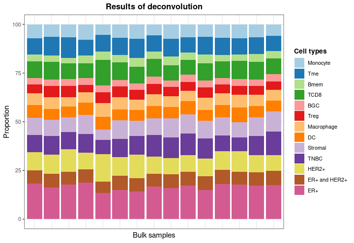


### Saving `DigitalDLSorter` object and trained models {#save}

**digitalDLSorteR** provides different ways to save models to disk and to retrieve them in the `DigitalDLSorter` object. First, you can save `DigitalDLSorter` objects as RDS files. Since this type of files only accepts native R objects, they are not able to store complex data structures such as keras Python objects (`keras.engine.sequential.Sequential` class). To make it possible, **digitalDLSorteR** implements a `saveRDS` generic function that converts the keras model object into a list with the network achitecture and the weights after training. These two pieces of information are the minimal part needed to perform new predictions. When the model is to be used, it is compiled back to a `keras.engine.sequential.Sequential` object. 


```r
## this code will not be run
saveRDS(object = DDLSToy, file = "valid/path")
```

However, the optimizer state is not saved in this way. To offer the possibility to save the complete model, **digitalDLSorteR** has the `saveTrainedModelAsH5` function to save to disk the DNN model, and `loadTrainedModelFromH5` to load-back models into `DigitalDLSorter` objects. Note that only the keras model is saved as an HDF5 file in this way. 


```r
## this code will not be run
saveTrainedModelAsH5(DDLSToy, file.path = "valid/path")
DDLSToy <- loadTrainedModelFromH5(DDLSToy)
```

## References


<!-- ## Session info {.unnumbered} -->

<!-- ```{r sessionInfo, echo=FALSE} -->
<!-- sessionInfo() -->
<!-- ``` -->
