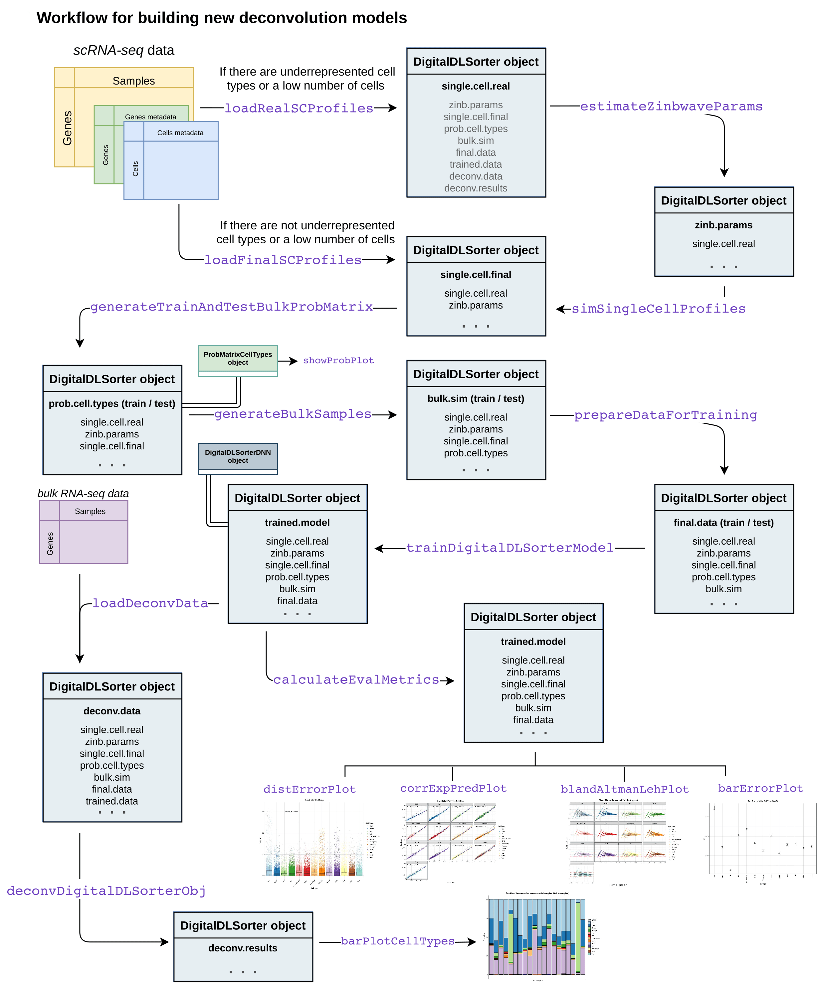

```{r setup, include=FALSE}
# suppressMessages(library(digitalDLSorteR))
knitr::opts_chunk$set(
  echo = TRUE, dpi = 80, fig.width = 8, fig.height = 4.5, fig.align = "center",
  eval = digitalDLSorteR:::.checkPythonDependencies(alert = "none")
)
```


**digitalDLSorteR** implements all the necessary tools to build new context-specific deconvolution models from previously identified single-cell RNA-Seq data. Taking into account the variability of some cell types depending on the context in which they are found, we aim to generate different models to each environment. From our view, this opens a door to more accurate and specific models instead of using generic transcriptional profiles as a reference (i.e., the use of peripheral blood mononuclear cell (PBMC) to estimate the proportions of tumor-infiltrating lymphocytes in oncological settings). In this vignette, we will show the workflow required to build new context-specific deconvolution models. For this, simulated data are going to be used in order to avoid long runtimes. The performance of a real model can be explored in the article [Performance of a real model: deconvolution of colorectal cancer samples](realModelExample.html).

This workflow is computationally more expensive than using pre-trained models, so we recommend building new models if you want to deconvolute samples from an unavailable model or in case you think your scRNA-Seq data provide a better picture of this environment than the ones already offered in `digitalDLSorteRmodels`. In any case, **digitalDLSorteR** provides a set of functionalities that make this process easier and computationally cheaper in terms of RAM usage: batch processing of data and the use of the [HDF5Array](https://bioconductor.org/packages/release/bioc/html/HDF5Array.html) and [DelayedArray](https://bioconductor.org/packages/release/bioc/html/DelayedArray.html) packages (see the article [HDF5 files as back-end](https://diegommcc.github.io/digitalDLSorteR/articles/hdf5Backend.html) for more information). Furthermore, all steps are centralized in the `DigitalDLSorter` S4-class, the core of **digitalDLSorteR**, to provide a good user experience and keep all the information tidy in the same object.

The main steps needed to build new models are summarized below, but you can find a visual summary in the following figure.

1. [Loading data into a `DigitalDLSorter` object](#load)
2. [Oversampling of single-cell profiles (optional)](#oversample)
4. [Generation of cell composition matrix for pseudo-bulk RNA-Seq samples](#cell-prop)
5. [Simulation of pseudo-bulk RNA-Seq samples using known cell composition](#simul-bulk)
6. [Deep Neural Network training](#dnn)
7. [Evaluation of trained deconvolution model on test data: visualization of results](#eval)
8. [Loading and deconvolution of new bulk RNA-Seq samples](#new-bulk)
9. [Saving `DigitalDLSorter` object and trained models](#save)


<!-- ```{r workflowfull_newModels, fig.cap = "Workflow to build new context-specific deconvolution models", echo = FALSE} -->
<!--  -->
<!-- ``` -->

### Loading data into a `DigitalDLSorter` object {#load}

First, we have to load scRNA-Seq data into a `DigitalDLSorter` object. This S4 class contains all the slots needed to store the data generated during the construction of new deconvolution models. The information needed consists of three elements: 

* Count matrix: a matrix with genes as rows and cells as columns.
* Cells metadata: a table with annotations (columns) for each cell (rows). The expected information in this data frame is a column with the ID used for each cell, a column with the corresponding cell types, and metadata that could be used as covariates in the following steps (gender, sample type...).
* Genes metadata with annotations (columns) for each gene (rows). This data frame should contain the notation used for each gene in the counts matrix and other covariates such as gene length, GC content, etc. 

This information may come from a pre-loaded `SingleCellExperiment` object or from files stored on disk. For the latter, tsv, tsv.gz, sparse matrices (mtx) and HDF5 (h5) formats are accepted. Finally, data will be stored as a `SingleCellExperiment` object in the `single.cell.real` slot of the new `DigitalDLSorter` object.

In addition, it is recommended to provide the bulk RNA-seq to be deconvoluted at this point so that only genes actually relevant for the deconvolution process are considered. The package will filter genes according to different criteria so that only those important for the task will be used for downstream steps. 

In this tutorial, we will simulate both the scRNA-seq data used as a reference and the bulk RNA-seq to be deconvoluted. This is done by randomly sampling from a Poisson distribution, but importantly these simulated data are only for descriptive purposes to show functionalities of the package, they are not intended to generate realistic transcriptomic data.

```{r}
## loading the packages
suppressMessages(library("digitalDLSorteR"))
suppressMessages(library("SingleCellExperiment"))
suppressMessages(library("SummarizedExperiment"))

## set seed for reproducibility
set.seed(123)
sce <- SingleCellExperiment(
  matrix(
    stats::rpois(50000, lambda = 5), nrow = 500, ncol = 100, 
    dimnames = list(paste0("Gene", seq(500)), paste0("RHC", seq(100)))
  ),
  colData = data.frame(
    Cell_ID = paste0("RHC", seq(100)),
    Cell_Type = sample(
      x = paste0("CellType", seq(5)), size = 100, replace = TRUE
    )
  ),
  rowData = data.frame(
    Gene_ID = paste0("Gene", seq(500))
  )
)

se <- SummarizedExperiment(
  matrix(
    stats::rpois(10000, lambda = 5), nrow = 500, ncol = 20, 
    dimnames = list(paste0("Gene", seq(500)), paste0("Sample_", seq(20)))
  ),
  colData = data.frame(
    Sample_ID = paste0("Sample_", seq(20))
  ),
  rowData = data.frame(
    Gene_ID = paste0("Gene", seq(500))
  )
)
```

Then, we create the `DigitalDLSorter` object as follows: 

```{r loadData}
DDLSToy <- createDDLSobject(
  sc.data = sce,
  sc.cell.ID.column = "Cell_ID",
  sc.gene.ID.column = "Gene_ID",
  sc.filt.genes.cluster = FALSE, 
  sc.log.FC = FALSE,
  bulk.data = se,
  bulk.sample.ID.column = "Sample_ID",
  bulk.gene.ID.column = "Gene_ID",
  project = "ToyExample"
)
DDLSToy
```

In documentation, you can see all the parameters that `createDDLSobject` offers to process the loaded data, such as `sc.min.counts` and `sc.min.cells`, etc. In this case, we are setting `sc.log.FC = FALSE` due to the fact these are simulated data and there is no biological signal in every cell type. However, this parameter should be set to `TRUE` when working with actual data. 

In addition, in case of working with very large scRNA-Seq datasets, **digitalDLSorteR** allows to use HDF5 files as back-end to handle data that do not fit in RAM using the [HDF5Array](https://bioconductor.org/packages/release/bioc/html/HDF5Array.html) and [DelayedArray](https://bioconductor.org/packages/release/bioc/html/DelayedArray.html) packages. We only recommend them when analyzing huge amounts of data that don't fit in RAM. HDF5 files, despite being very powerful and useful for dealing with RAM problems, make processes much slower. As an example, the following code chunk would create an HDF5 file with the scRNA-seq data that allows working without loading them into RAM. See the documentation for more details.

```{r, eval = FALSE}
DDLSToy <- createDDLSobject(
sc.data = sce,
  sc.cell.ID.column = "Cell_ID",
  sc.gene.ID.column = "Gene_ID",
  sc.filt.genes.cluster = FALSE, 
  sc.log.FC = FALSE,
  sc.gene.ID.column = "external_gene_name",
  sc.file.backend = "singlecell_data.h5",
  project = "ToyExampleBreast"
)
```

### Oversampling of single-cell profiles {#oversample}

**digitalDLSorteR** offers the possibility to simulate new single-cell profiles from real ones to increase signal and variability in small datasets or when under-represented cell types are present. This step is optional but recommended in these situations. The `estimateZinbwaveParams` and `simSCProfiles` functions are used for this purpose. 

#### Tuning of the ZINB-WaVE model to simulate new single-cell profiles {#zinb}

First step is to estimate a set of parameters that fit the real single-cell data to simulate new realistic single-cell profiles. We chose the ZINB-WaVE framework [@Risso2018] that estimates the parameters of a ZINB (zero-inflated negative binomial) distribution. It was chosen for its ability to accommodate not only variability within a particular cell type, but also variability within the entire experiment. 

This process is performed by the `estimateZinbwaveParams` function, which makes use of the [zinbwave](https://bioconductor.org/packages/release/bioc/html/zinbwave.html) package. You must specify the column corresponding to cell types in the cells metadata, and other cell/gene covariates can be added based on your experimental design, such as patient, gender or gene length. This process may take a few minutes to run, so be patient. In any case, you can adjust the number of used threads in some steps during the estimation with the `threads` argument depending on your computational resources by the [BiocParallel](https://www.bioconductor.org/packages/release/bioc/html/BiocParallel.html) package. In case of large datasets with some cell types under-represented, the `subset.cells` parameter allows making a subset of cells to speed up the process. With the following code, a total of 40 cells will be taken from the original scRNA-Seq data and used to fit a ZINB-WaVE model.

```{r}
DDLSToy <- estimateZinbwaveParams(
  object = DDLSToy,
  cell.ID.column = "Cell_ID",
  gene.ID.column = "Gene_ID",
  cell.type.column = "Cell_Type",
  subset.cells = 40,
  threads = 1,
  verbose = TRUE
)
```

```{r}
DDLSToy
```

#### Simulating new single-cell profiles {#simul-sc}

Once ZINB-WaVE parameters have been estimated, the `simSCProfiles` function uses them to simulate new single-cell profiles based on the real ones. It is done by randomly sampling from a negative binomial distribution with the estimated ZINB parameters $\mu$ and $\theta$, and introducing dropouts by sampling from a binomial distribution with the estimated probability $\pi$. You must specify the number of cell profiles per cell type to be generated (`n.cells`). For example, if your data set is composed of 5 cell types and `n.cells` is equal to 10, the number of simulated profiles will be 50. 

```{r}
DDLSToy <- simSCProfiles(
  object = DDLSToy,
  cell.ID.column = "Cell_ID",
  cell.type.column = "Cell_Type",
  n.cells = 10,
  suffix.names = "_Simul",
  verbose = TRUE
)
```

These simulated single-cell profiles are stored in `single.cell.simul` slot to be used to simulate new bulk RNA-Seq profiles with a known cell composition.

```{r}
DDLSToy
```

In this step, it is also possible to store the new simulated single-cell profiles in a HDF5 file. Indeed, they can be simulated in batches, avoiding loading all data into RAM. The code would be as follows: 

```{r, eval = FALSE}
DDLSToy <- simSCProfiles(
  object = DDLSToy,
  cell.ID.column = "Cell_ID",
  cell.type.column = "Cell_Type",
  n.cells = 10,
  suffix.names = "_Simul",
  file.backend = "simulated_singlecell_data.h5",
  block.processing = TRUE,
  block.size = 20, # number of single-cell profiles simulated per batch
  verbose = TRUE
)
```


### Generation of cell composition matrix for pseudo-bulk RNA-Seq samples {#cell-prop}

To simulate pseudobulk samples with a known cell composition, it is necessary to generate a cell composition matrix that determines the proportion of every cell type in every sample. This is carried out using the `generateBulkCellMatrix` function that stores these results in the `prob.cell.types` slot as a `ProbMatrixCellTypes` object.

This process starts with dividing single-cell profiles into training and test data (see `train.freq.cells` argument in documentation). Each subset will be used to generate each subset of bulk samples (training and test) in order to avoid any distortion of results during model evaluation. Then, proportions are generated using six different methods to avoid biases during training due to the cellular composition of the simulated bulk RNA-Seq samples:

1. Cell proportions are randomly sampled from a truncated uniform distribution with predefined limits according to _a priori_ knowledge of the abundance of each cell type (see `prob.design` argument). This information can be inferred from the single cell analysis itself or from the literature.
2. A second set is generated by randomly permuting cell type labels from a distribution generated by the previous method.
3. Cell proportions are randomly sampled as by method 1 without replacement.
4. Using the last method to generate proportions, cell types labels are randomly sampled.
5. Cell proportions are randomly sampled from a Dirichlet distribution.
6. Pseudo-bulk RNA-Seq samples composed of the same cell type are generated in order to provide 'pure' pseudobulk samples.

Proportion of each type of sample can be set by the `proportion.method` argument. Moreover, `prob.sparsity` controls the number of zeros (number of cell types that will be zero in each sample) produced by each method. This parameter was introduced in order to increase the level of sparsity in the simulated cell composition matrices in order to increase the number of situations the model is trained with.  Finally, other important parameters are `n.cells`, which determines the number of cells that will compose each pseudobulk sample, and `num.bulk.samples`, which defines the total number of pseudobulk samples generated (training + test subsets). The code would be as follows:

```{r}
## for reproducibility
set.seed(123)

## prior knowledge for prob.design argument
probMatrix <- data.frame(
  Cell_Type = paste0("CellType", seq(5)),
  from = c(rep(1, 2), 1, rep(30, 2)),
  to = c(rep(15, 2), 50, rep(70, 2))
)

DDLSToy <- generateBulkCellMatrix(
  object = DDLSToy,
  cell.ID.column = "Cell_ID",
  cell.type.column = "Cell_Type",
  prob.design = probMatrix,
  num.bulk.samples = 250,
  n.cells = 100,
  verbose = TRUE
)
```

```{r}
DDLSToy
```

Remember that this is a simulated example. In real circumstances, depending on the number of single-cell profiles loaded/simulated at the beginning and the computational resources, about 15,000-20,000 samples would be recommended. You can inspect the cell composition matrix created in this step with the getter function `getProbMatrix`:

```{r}
head(getProbMatrix(DDLSToy, type.data = "train"))
tail(getProbMatrix(DDLSToy, type.data = "train"))
```

Moreover, distributions can be plotted using the `showProbPlot` function:

```{r showProbPlot_newModels}
lapply(
  1:6, function(x) {
    showProbPlot(
      DDLSToy, type.data = "train", set = x, type.plot = "boxplot"
    )
  }
)
```

### Simulation of pseudo-bulk RNA-Seq samples with known cell composition {#simul-bulk}

Now, the simulated cell proportions are used to create the pseudobulk samples. They are simulated by aggregating single-cell profiles of each cell type according to these proportions. The idea is to simulate a real bulk RNA-Seq data in which the gene expression levels of each cell are aggregated into a single sample. Therefore, this expression matrix will be generated according to the following equation:

\begin{equation}
  T_{ij} = \sum_{k = 1}^{K} \sum_{z = 1}^Z C_{izk} 
\end{equation}

\begin{equation*}
  \textrm{such as} \left\{
\begin{array}{l}
  i = 1 \ldots M;\\
  j = 1 \ldots N \\
  Z = 1 \ldots \textrm{n.cells} \cdot P_{kj} \\
  \sum_{k = 1}^K Z \cdot P_{kj} = \textrm{n.cells}
\end{array}
\right.  
\end{equation*}

where $T_{ij}$ is the expression level of gene $i$ in bulk sample $j$; $C_{izk}$ is the expression level of gene $i$ in cell $z$ in bulk sample $j$; and $P_{kj}$ is the proportion of cell type $k$ in bulk sample $j$ (the cell composition matrix generated in the previous step). $Z$ represents the number of cells that will make up the proportion of cell type $k$ in the bulk sample $j$ and corresponds to the `n.cells` parameter from the `generateBulkCellMatrix` function. Cells are randomly sampled based on their cell type and how they were divided into training and test subsets. This step is performed by `simBulkProfiles` as follows:

```{r simBulkProfiles}
DDLSToy <- simBulkProfiles(
  object = DDLSToy, type.data = "both"
)
```

These samples are stored as a `SummarizedExperiment` object in the `bulk.simul` slot where they can be inspected at any time:

```{r}
DDLSToy
```

The `simBulkProfiles` offers different ways to simulate these pseudobulk samples, but in our experience, the best option is to aggregate raw counts and normalize them afterwards (`pseudobulk.function = "AddRawCount"`).

Again, these pseudobulk samples can be stored as an HDF5 file. This is the most recommended step of **digitalDLSorteR** to use this functionality, as it is the most computationally expensive part of the package and these samples will only be accessed during training and evaluation of Deep Neural Network (DNN) model. As in `simSCProfiles`, samples can be simulated in batches and a desired number of threads can also be set: 

```{r, eval = FALSE}
DDLSToy <- simBulkProfiles(
  object = DDLSToy, 
  type.data = "both", 
  file.backend = "pseudobulk_samples.h5",
  block.processing = TRUE,
  block.size = 1000, 
  threads = 2
)
```

### Deep Neural Network training

Once the pseudobulk samples have been generated, a deep neural network can be trained and evaluated. `trainDigitalDLSorterModel` is the function in charge of both steps and uses the [keras](https://cran.r-project.org/package=keras) package with [tensorflow](https://cran.r-project.org/package=tensorflow) as back-end. If you want more information about [keras](https://cran.r-project.org/package=keras) or have any problems during its installation, please see [Keras/TensorFlow installation and configuration](https://diegommcc.github.io/digitalDLSorteR/articles/kerasIssues.html) for more details. In any case, the `installTFpython` function automates this process, so we recommend its use.

In terms of architecture and model parameters, `trainDigitalDLSorterModel` implements by default two hidden layers with 200 neurons each, although any of these parameters can be modified through the `trainDigitalDLSorterModel` parameters. In addition, for a more customized model, it is possible to provide a pre-built model in the `custom.model` parameter. See the documentation for more details. 

The code with default parameters is as follows:

```{r, warning = FALSE}
DDLSToy <- trainDDLSModel(
  object = DDLSToy, scaling = "standardize", batch.size = 12
)
```

`DDLSToy` will contain a `DigitalDLSorterDNN` object with all the information associated with the model in the `trained.model` slot: a `keras.engine.sequential.Sequential` object with the trained model, metrics and loss function histories during training, and prediction results on test data.

```{r}
DDLSToy
```

Since this is a 'toy' example, results are not very accurate. For a real example of a well trained model, see the [Performance of a real model: deconvolution of colorectal cancer samples](realModelExample.html) vignette.

#### `on.the.fly` argument

The `on.the.fly` argument of `trainDigitalDLSorterModel` allows generating pseudobulk samples 'on the fly'. It means that it is possible to skip the simulation of pseudobulk samples performed by the `simBulkProfiles` function, and create the samples at the same time as the neural network is being trained. Of course, running times during training will increase, but data are not loaded into RAM or stored in large HDF5 files. To use this functionality, it is only necessary to set `on.the.fly = TRUE` as follows:

```{r, eval = FALSE}
DDLSToy <- trainDDLSModel(object = DDLSToy, on.the.fly = TRUE)
```

### Evaluation of trained deconvolution model on test data: visualization of results {#eval}

While the prediction results on test data are informative about the performance of the model, a more comprehensive analysis is needed. For this task, **digitalDLSorteR** provides a set of visualization functions to represent a variety of error metrics in different ways.

First, `calculateEvalMetrics` is needed to calculate the error metrics to be plotted. By default, absolute error (`AbsErr`), proportional absolute error (`ppAbsErr`), squared error (`SqrErr`) and proportional squared error (`ppSqrErr`) are calculated for every sample of test data. Furthermore, they are all aggregated using their average values according to three criteria: each cell type (`CellType`), proportion bins of 0.1 (`pBin`) and number of different cell types (`nCellTypes`).

```{r}
DDLSToy <- calculateEvalMetrics(object = DDLSToy)
```

Now, these results can be plotted by the following battery of functions.

#### `distErrorPlot` and `barErrorPlot`: error distributions {#dist-err}

The `distErrorPlot` function allows plotting how errors are distributed in different ways. Moreover, it allows to split the plots in different panels representing how errors are distributed by a given variable. Available variables are cell types (`CellType`) and number of cell types in samples (`nCellTypes`). In the following example, we will represent the overall errors by cell type.

```{r distErr1_newModels}
distErrorPlot(
  DDLSToy,
  error = "AbsErr",
  x.by = "CellType",
  color.by = "CellType", 
  error.labels = FALSE, 
  type = "boxplot",
  size.point = 1
)
```

Now, if you want to know if there is a bias towards a specific cell type, yo can use `facet.by` parameter to split plots by cell type:

```{r distErr2_newModels, warning=FALSE, fig.height=4}
distErrorPlot(
  DDLSToy,
  error = "AbsErr",
  facet.by = "CellType",
  color.by = "nCellTypes", 
  type = "violinplot",
  size.point = 1
)
```

It is also possible to represent errors by number of different cell types in samples: 

```{r distErr3_newModels, fig.height=4}
distErrorPlot(
  DDLSToy,
  error = "AbsErr",
  color.by = "CellType", 
  facet.by = "nCellTypes",
  type = "boxplot",
  size.point = 1
)
```

Finally, with `barErrorPlot`, the mean error values with their corresponding dispersion ranges can be plotted as follows:

```{r barError_newModels}
barErrorPlot(DDLSToy, error = "MAE", by = "CellType")
```


#### `corrExpPredPlot`: correlation plots between predicted and expected proportions {#corr-err}

Ideally, the model should provide predictions that linearly match the actual proportions. Therefore, you can generate correlation plots to assess the model performance. By default, the Pearson's coefficient correlation ($R$) and the concordance correlation coefficient ($CCC$) are shown as annotations on the plots. The latter is a more realistic measure as it decreases as the points move away from the identity.

```{r corr1_newModels}
corrExpPredPlot(
  DDLSToy,
  color.by = "CellType",
  size.point = 1,
  corr = "both"
)
```

As in the previous case, plots can be split according to different variables. Now, let's split the results by `CellType` and `nCellTypes` as an example:

```{r corr2_newModels}
corrExpPredPlot(
  DDLSToy,
  color.by = "CellType",
  facet.by = "CellType",
  size.point = 1, 
  filter.sc = FALSE,
  corr = "both"
)
```

```{r corr3_newModels}
corrExpPredPlot(
  DDLSToy,
  color.by = "CellType",
  facet.by = "nCellTypes",
  size.point = 1,
  corr = "both"
)
```


#### `blandAltmanLehPlot`: Bland-Altman agreement plots {#bland-err}

The `blandAltmanLehPlot` function allows to display Bland-Altman agreement plots. This is a kind of graphical method for comparing the level of agreement between two different sets of values. The differences between predictions and actual proportions are plotted against their averages. The central dashed line represents the mean difference, while the two red dashed lines are the limits of agreement, which are defined as the mean difference plus and minus 1.96 times the standard deviation of the differences. 95% of the differences are expected to fall between these two limits, so the wider the margins, the worse the performance. It is also possible to display it in $log_2$ space.

```{r bland1_newModels}
blandAltmanLehPlot(
  DDLSToy, 
  color.by = "CellType",
  log.2 = FALSE,
  size.point = 1,
  filter.sc = TRUE,
  density = TRUE,
)
```

In addition, this function has the same behaviour as previous ones, as it is possible to split plots:

```{r bland2_newModels}
blandAltmanLehPlot(
  DDLSToy, 
  color.by = "nCellTypes",
  facet.by = "nCellTypes",
  log.2 = FALSE,
  size.point = 1,
  filter.sc = TRUE,
  density = FALSE
)
```


### Loading and deconvolution of new bulk RNA-Seq samples {#new-bulk}

Once the model has been evaluated, we can deconvolute the bulk RNA-seq data already loaded at the beginning of the pipeline. We could load new data using the `loadDeconvData` function, but we recommend doing it by using the `createDDLSobject` function, since it will take only those genes shared between the two kinds of data, so that only features relevant for the deconvolution process will be used. Anyhow, to load new data, the call function would be as follows: 

```{r, eval = FALSE}
suppressMessages(library(SummarizedExperiment, quietly = TRUE))
seExample <- SummarizedExperiment(assay = list(counts = countsBulk))

DDLSToy <- loadDeconvData(
  object = DDLSToy,
  data = seExample, 
  name.data = "Simulated.example"
)
```

In our case, we can directly use the `deconvDigitalDLSorterObj` function, which will deconvolute the cell proportions of the cell types considered by the model. The predicted proportions can be represented by the `barPlotCellTypes` function. The cell composition matrix is stored in the `deconv.results` slot.

```{r resultsBarPlot_newModels, warning=FALSE}
DDLSToy <- deconvDDLSObj(
  object = DDLSToy, 
  name.data = "Bulk.DT",
  normalize = TRUE,
  scaling = "standardize",
  verbose = FALSE
)
## plot results
barPlotCellTypes(
  DDLSToy, name.data = "Bulk.DT", 
  rm.x.text = TRUE, color.line = "black"
)
```


### Saving `DigitalDLSorter` object and trained models {#save}

**digitalDLSorteR** provides different ways to save models on disk and to retrieve them in the `DigitalDLSorter` object. First, you can save `DigitalDLSorter` objects as RDS files. Since this file format only accepts native R objects, they are not able to store complex data structures such as keras Python objects (`keras.engine.sequential.Sequential` class). To make it possible, **digitalDLSorteR** implements a `saveRDS` generic function that converts the keras model object into a list with network architecture and weights after training. These two pieces of information are the minimal part needed to perform new predictions. When the model is to be used, the model is compiled back to a `keras.engine.sequential.Sequential` object. 

```{r saveRDS, eval=FALSE}
## this code will not be run
saveRDS(object = DDLSToy, file = "valid/path")
```

However, the optimizer state is not saved in this way. To offer the possibility to also save the optimizer, **digitalDLSorteR** offers the `saveTrainedModelAsH5` function to save on disk the whole neural network, and `loadTrainedModelFromH5` to load-back models into `DigitalDLSorter` objects. Note that in this way just the keras model is saved as an HDF5 file. 

```{r saveHDF5Model, eval=FALSE}
## this code will not be run
saveTrainedModelAsH5(DDLSToy, file.path = "valid/path")
DDLSToy <- loadTrainedModelFromH5(DDLSToy)
```

## References


<!-- ## Session info {.unnumbered} -->

<!-- ```{r sessionInfo, echo=FALSE} -->
<!-- sessionInfo() -->
<!-- ``` -->
