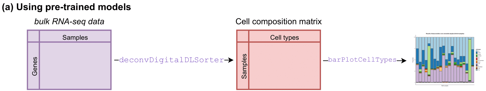
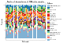

**digitalDLSorteR** offers the possibility to use pre-trained context-specific deconvolution models included in **digitalDLSorteRmodels** package (<https://github.com/diegommcc/digitalDLSorteRmodels>) to deconvolute new bulk RNA-Seq samples from the same biological environment. This is the simplest way to use **digitalDLSorteR** and only requires loading into R a raw bulk RNA-Seq matrix with genes as rows (annotated as _SYMBOL_) and samples as columns, and selecting the desired model. This is done by the `deconvDigitalDLSorter` function which normalizes the new samples to counts per million (CPMs) by default, so this matrix must be provided as raw counts. After the process, estimated cell composition of each sample can be explored as a bar chart using the `barPlotCellTypes` function (workflow summarized in the figure below).



<!--  -->

## Available models

So far, available models just cover two possible biological environments: breast cancer and colorectal cancer. These models are able to accurately deconvolute new samples from the same environment as they have been trained (with transcriptional profiles from these specific contexts). 

### Breast cancer models

There are two different deconvolution models for breast cancer samples that differ in the level of specificity. Both have been trained using data from @Chung2017 ([GSE75688](https://www.ncbi.nlm.nih.gov/geo/query/acc.cgi?acc=GSE75688)).

* `breast.chung.generic`: this model considers 13 cell types, four of them being the intrinsic molecular subtypes of breast cancer (`ER+`, `HER2+`, `ER+/HER2+` and `TNBC`) and the rest immune and stromal cells (`Stromal`, `Monocyte`, `TCD4mem` (memory CD4+ T cells), `BGC` (germinal center B cells), `Bmem` (memory B cells), `DC` (dendritic cells), `Macrophage`, `TCD8` (CD8+ T cells) and `TCD4reg` (regulatory CD4+ T cells)).
* `breast.chung.generic`: this model considers 7 cell types, being generic groups of the cell types considered by the specific version: B cells (`Bcell`), T CD4+ cells (`TcellCD4`), T CD8+ cells (`TcellCD8`), monocytes (`Monocyte`), dendritic cells (`DCs`), stromal cells (`Stromal`) and tumor cells (`Tumor`).

### Colorectal cancer model

This model was created with data from @Li2017 ([GSE81861](https://www.ncbi.nlm.nih.gov/geo/query/acc.cgi?acc=GSE81861)). It is called `colorectal.li` and considers 10 cell types: cancer cells (`CRC`), epithelial (`Ep`), monocytes (`M`), macrophages (`Mc`), fibroblasts (`Fb`), CD4 T cells (`CD4`), CD8 T cells (`CD8Gp`), CD8 T cells (`CD8Gn`), germinal center B cells (`gB`) and mature B cells (`pB`).

## Example using breast cancer samples from TCGA project

The following code chunk shows an example using `breast.chung.generic` model and a small portion of data from The Cancer Genome Atlas (TCGA) project [@Koboldt2012; @Ciriello2015] loaded from `digitalDLSorteRdata`:


```r
suppressMessages(library(digitalDLSorteR))
# to load pre-trained models
if (!requireNamespace("digitalDLSorteRmodels", quietly = TRUE)) {
  install.packages(
    "digitalDLSorteRmodels", 
    repos = "https://diegommcc.github.io/digitalDLSorteRmodelsRepo/"
  )
}
suppressMessages(library(digitalDLSorteRmodels))
# data for example
if (!requireNamespace("digitalDLSorteRdata", quietly = TRUE)) {
  install.packages(
    "digitalDLSorteRdata", 
    repos = "https://diegommcc.github.io/digitalDLSorteRdataRepo/"
  )
}
suppressMessages(library(digitalDLSorteRdata))
# disable eager execution for compatibility issues
tensorflow::tf$compat$v1$disable_eager_execution()
# loading model and example data from digitalDLSorteRdata
data(breast.chung.generic)
data(TCGA.breast.small)
```

`breast.chung.generic` is a DigitalDLSorterDNN-like list (list with the same structure as a `DigitalDLSorterDNN` object) that can be inspected to check which cell types are considered by the model, how well it performed on test data, etc. As the **digitalDLSorteRmodels** package stores all these objects as DigitalDLSorterDNN-like lists in order to remove its dependency on **digitalDLSorteR**, if you want to inspect the models you have to transform these lists into actual `DigitalDLSorterDNN` objects. This is done with the `listToDDLSDNN` function.


```r
breast.chung.generic <- listToDDLSDNN(breast.chung.generic)
breast.chung.generic
```

```
## Trained model: 20 epochs
##   Training metrics (last epoch):
##     loss: 0.0222
##     accuracy: 0.9051
##     mean_absolute_error: 0.0186
##     categorical_accuracy: 0.9051
##   Evaluation metrics on test data:
##     loss: 0.0154
##     accuracy: 0.9629
##     mean_absolute_error: 0.0112
##     categorical_accuracy: 0.9629
```


```r
cell.types(breast.chung.generic)
```

```
## [1] "Tumor"    "Stromal"  "Monocyte" "TcellCD4" "Bcell"    "DCs"      "TcellCD8"
```

Now, we can use it to deconvolute `TCGA.breast.small` samples as follows:


```r
# deconvolution
deconvResults <- deconvDigitalDLSorter(
  data = TCGA.breast.small,
  model = breast.chung.generic,
  normalize = TRUE
)
```

```
## === Filtering 32876 features in data that are not present in trained model
```

```
## === Setting 11305 features that are not present in trained model to zero
```

```
## === Normalizing data
```

```
## === Predicting cell types present in the provided samples
```

```
## DONE
```

```r
rownames(deconvResults) <- paste("Sample", seq(nrow(deconvResults)), sep = "_")
head(deconvResults)
```

```
##              Tumor     Stromal   Monocyte     TcellCD4        Bcell       DCs   TcellCD8
## Sample_1 0.5716878 0.009549672 0.02705323 0.0009312485 2.085090e-05 0.2735238 0.11723338
## Sample_2 0.4737065 0.015726041 0.01532314 0.0008934758 1.881223e-05 0.3624099 0.13192214
## Sample_3 0.5632827 0.011810658 0.02118549 0.0009122477 2.213673e-05 0.3083327 0.09445395
## Sample_4 0.4798905 0.013469697 0.01989893 0.0007664507 4.999202e-05 0.3453780 0.14054649
## Sample_5 0.6283218 0.015287977 0.07622542 0.0022742257 3.257442e-06 0.1749347 0.10295264
## Sample_6 0.4960882 0.015261916 0.02924263 0.0010657815 1.409765e-05 0.3112173 0.14710997
```

`deconvDigitalDLSorter` returns a data frame with the samples as rows ($k$) and the cell types considered by the model as columns ($j$). Each entry corresponds to the proportion of cell type $k$ in sample $i$. To visually evaluate these results using a bar chart, you can use the `barplotCellTypes` function as follows:


```r
barPlotCellTypes(
  deconvResults, 
  color.line = "black",
  title = "Results of deconvolution of TCGA breast samples"
)
```


Finally, `deconvDigitalDLSorterObj` also offers two parameters in case you want to simplify the results by aggregating cell proportions of similar cell types: `simplify.set` and `simplify.majority`. For instance, we can summarize dendritic cells (DCs) and monocytes in the new class mononuclear phagocyte system (MPS) using `simplify.set` as follows:


```r
# deconvolution
deconvResultsSum <- deconvDigitalDLSorter(
  data = TCGA.breast.small,
  model = breast.chung.generic,
  normalize = TRUE,
  simplify.set = list(MPS = c("DCs", "Monocyte"))
)
```

```
## === Filtering 32876 features in data that are not present in trained model
```

```
## === Setting 11305 features that are not present in trained model to zero
```

```
## === Normalizing data
```

```
## === Predicting cell types present in the provided samples
```

```
## DONE
```

```r
rownames(deconvResultsSum) <- paste("Sample", seq(nrow(deconvResults)), sep = "_")
barPlotCellTypes(
  deconvResultsSum, 
  rm.x.text = FALSE,
  color.line = "black",
  title = "Results of deconvolution of TCGA breast samples (simplified)"
)
```



On the other hand, `simplify.majority` does not create new classes but sums the proportions to the most abundant cell type from those provided in each sample. See the documentation and examples for more details.

## Contribute your own models

New models are planned to be published soon, but you can contribute your own models by making them available to other users. Please do not hesitate to contact us! We'll check the models and include them in the **digitalDLSorteRmodels** package.

## References

<!-- ## Session info {.unnumbered} -->

<!-- ```{r sessionInfo, echo=FALSE} -->
<!-- sessionInfo() -->
<!-- ``` -->
