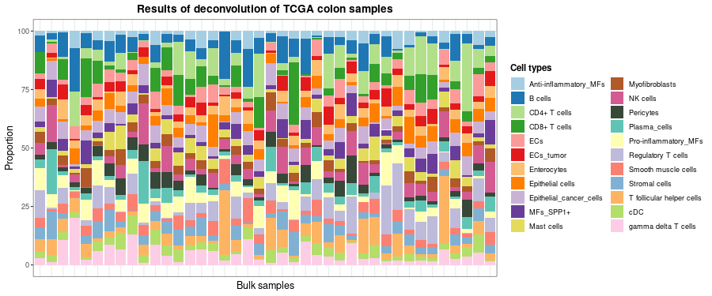

**digitalDLSorteR** offers the possibility to use pre-trained context-specific deconvolution models included in the **digitalDLSorteRmodels** R package (<https://github.com/diegommcc/digitalDLSorteRmodels>) to deconvolute new bulk RNA-seq samples from the same biological environment. This is the simplest way to use **digitalDLSorteR** and only requires loading into R a raw bulk RNA-seq matrix with genes as rows (annotated as _SYMBOL_) and samples as columns, and selecting the desired model. This is done by the `deconvDDLSPretrained` function, which normalizes the new samples to counts per million (CPMs) by default, so this matrix must be provided as raw counts. Afterwards, estimated cell composition of each sample can be explored as a bar chart using the `barPlotCellTypes` function.

<!-- ```{r workflow, fig.cap = "**Workflow to use pre-trained models**", echo = FALSE} -->
<!-- knitr::include_graphics("workflow_pretrained_models.png") -->
<!-- ``` -->

<!--  -->

## Available models

So far, available models only cover two possible biological environments: breast cancer and colorectal cancer. These models are able to accurately deconvolute new samples from the same environment as they have been trained on. 

### Breast cancer models

There are two deconvolution models for breast cancer samples that differ in the level of specificity. Both have been trained using data from @Chung2017 ([GSE75688](https://www.ncbi.nlm.nih.gov/geo/query/acc.cgi?acc=GSE75688)).

* `breast.chung.generic`: it considers 13 cell types, four of them being the intrinsic molecular subtypes of breast cancer (`ER+`, `HER2+`, `ER+/HER2+` and `TNBC`) and the rest immune and stromal cells (`Stromal`, `Monocyte`, `TCD4mem` (memory CD4+ T cells), `BGC` (germinal center B cells), `Bmem` (memory B cells), `DC` (dendritic cells), `Macrophage`, `TCD8` (CD8+ T cells) and `TCD4reg` (regulatory CD4+ T cells)).
* `breast.chung.generic`: this model considers 7 cell types that are generic groups of the cell types considered by the specific version: B cells (`Bcell`), T CD4+ cells (`TcellCD4`), T CD8+ cells (`TcellCD8`), monocytes (`Monocyte`), dendritic cells (`DCs`), stromal cells (`Stromal`) and tumor cells (`Tumor`).

### Colorectal cancer model

`DDLS.colon.lee` considers the following 22 cell types: Anti-inflammatory_MFs (macrophages), B cells, CD4+ T cells, CD8+ T cells, ECs (endothelial cells), ECs_tumor, Enterocytes, Epithelial cells, Epithelial_cancer_cells, MFs_SPP1+, Mast cells, Myofibroblasts, NK cells, Pericytes, Plasma_cells, Pro-inflammatory_MFs, Regulatory T cells, Smooth muscle cells, Stromal cells, T follicular helper cells, cDC (conventional dendritic cells), gamma delta T cells.

It has been generated using data from Lee, Hong, Etlioglu Cho et al., 2020 ([GSE132465](https://www.ncbi.nlm.nih.gov/geo/query/acc.cgi?acc=GSE132465), [GSE132257](https://www.ncbi.nlm.nih.gov/geo/query/acc.cgi?acc=GSE132257) and [GSE144735](https://www.ncbi.nlm.nih.gov/geo/query/acc.cgi?acc=GSE144735)). The genes selected to train the model were defined by obtaining the intersection between the scRNA-seq dataset and bulk RNA-seq data from the The Cancer Genome Atlas (TCGA) project [@Koboldt2012; @Ciriello2015] and using the **digitalDLSorteR**'s default parameters.

## Example using colorectal samples from the TCGA project

The following code chunk shows an example using the `DDLS.colon.lee` model and data from TCGA loaded from `digitalDLSorteRdata`:


```r
suppressMessages(library("digitalDLSorteR"))
# to load pre-trained models
if (!requireNamespace("digitalDLSorteRmodels", quietly = TRUE)) {
  remotes::install_github("diegommcc/digitalDLSorteRmodels")
}
suppressMessages(library(digitalDLSorteRmodels))
# data for examples
if (!requireNamespace("digitalDLSorteRdata", quietly = TRUE)) {
  remotes::install_github("diegommcc/digitalDLSorteRdata")
}
suppressMessages(library("digitalDLSorteRdata"))
suppressMessages(library("dplyr"))
suppressMessages(library("ggplot2"))
```

## Loading data


```r
# loading model from digitalDLSorteRmodel and example data from digitalDLSorteRdata
data("DDLS.colon.lee")
data("TCGA.colon.se")
```

`DDLS.colon.lee` is a `DigitalDLSorterDNN` object containing the trained model as well as specific information about it, such as cell types considered, number of epochs used during training, etc. 


```r
DDLS.colon.lee
```

```
## Trained model: 60 epochs
##   Training metrics (last epoch):
##     loss: 0.113
##     accuracy: 0.6851
##     mean_absolute_error: 0.0131
##     categorical_accuracy: 0.6851
##   Evaluation metrics on test data:
##     loss: 0.0979
##     accuracy: 0.7353
##     mean_absolute_error: 0.0117
##     categorical_accuracy: 0.7353
##   Performance evaluation over each sample: MAE MSE
```

Here you can check the cell types considered by the model: 


```r
cell.types(DDLS.colon.lee) %>% paste0(collapse = " / ")
```

```
## [1] "Anti-inflammatory_MFs / B cells / CD4+ T cells / CD8+ T cells / ECs / ECs_tumor / Enterocytes / Epithelial cells / Epithelial_cancer_cells / MFs_SPP1+ / Mast cells / Myofibroblasts / NK cells / Pericytes / Plasma_cells / Pro-inflammatory_MFs / Regulatory T cells / Smooth muscle cells / Stromal cells / T follicular helper cells / cDC / gamma delta T cells"
```

Now, we can use it to deconvolute `TCGA.colon.se` samples as follows:


```r
# deconvolution
deconvResults <- deconvDDLSPretrained(
  data = TCGA.colon.se,
  model = DDLS.colon.lee,
  normalize = TRUE
)
```

```
## === Filtering 57085 features in data that are not present in trained model
```

```
## === Setting 0 features that are not present in trained model to zero
```

```
## === Normalizing and scaling data
```

```
## === Predicting cell types present in the provided samples
```

```
## 
 1/17 [>.............................] - ETA: 0s
17/17 [==============================] - 0s 827us/step
## 
17/17 [==============================] - 0s 852us/step
```

```
## DONE
```

```r
rownames(deconvResults) <- paste("Sample", seq(nrow(deconvResults)), sep = "_")
head(deconvResults)
```

```
##          Anti-inflammatory_MFs     B cells CD4+ T cells CD8+ T cells         ECs  ECs_tumor Enterocytes Epithelial cells Epithelial_cancer_cells   MFs_SPP1+  Mast cells
## Sample_1            0.03555675 0.012629803 0.2033741772  0.009651524 0.005541965 0.01741250 0.009307317       0.07155292             0.059090368 0.005882895 0.037573148
## Sample_2            0.04712307 0.066985376 0.0743350908  0.037740953 0.034868974 0.04209921 0.042306840       0.03910230             0.027248619 0.064652219 0.043691441
## Sample_3            0.04327271 0.040529914 0.0704342276  0.065242805 0.005649931 0.05630094 0.049890675       0.05444700             0.044213723 0.028884981 0.046738196
## Sample_4            0.06370533 0.087266184 0.0009350295  0.025520578 0.063553512 0.06356230 0.042612039       0.01939960             0.062976740 0.021837091 0.006687692
## Sample_5            0.02191241 0.074413352 0.2854489684  0.011043770 0.006262523 0.06074690 0.048464730       0.01496455             0.030808715 0.039284099 0.021862382
## Sample_6            0.05057831 0.009333173 0.0532203354  0.045282334 0.007942557 0.05870201 0.012052140       0.15696421             0.005358713 0.020576822 0.106369726
##          Myofibroblasts   NK cells  Pericytes Plasma_cells Pro-inflammatory_MFs Regulatory T cells Smooth muscle cells Stromal cells T follicular helper cells         cDC
## Sample_1     0.01825435 0.20807563 0.04628117   0.03875881          0.004553904       0.0008091913         0.004929543    0.02901828               0.100938752 0.034195002
## Sample_2     0.06812529 0.07469994 0.02922466   0.01664688          0.024583304       0.0906273201         0.037988264    0.03085840               0.059172753 0.030084079
## Sample_3     0.05523872 0.05755380 0.02136340   0.04671246          0.007121264       0.0678701103         0.036586598    0.08270273               0.036124315 0.065181993
## Sample_4     0.02784961 0.06164910 0.04961384   0.03491505          0.019962545       0.0492653102         0.022256006    0.09293170               0.059893306 0.057660546
## Sample_5     0.02031603 0.04073286 0.02935413   0.02051810          0.061510812       0.1044049710         0.024523731    0.04414546               0.004997779 0.006953675
## Sample_6     0.02457041 0.03025284 0.01038808   0.04958449          0.001022621       0.1324384362         0.072353281    0.02527887               0.017107340 0.067269459
##          gamma delta T cells
## Sample_1          0.04661207
## Sample_2          0.01783506
## Sample_3          0.01793949
## Sample_4          0.06594691
## Sample_5          0.02733001
## Sample_6          0.04335385
```

`deconvDDLSPretrained` returns a data frame with samples as rows ($k$) and cell types considered by the model as columns ($j$). Each entry corresponds to the proportion of cell type $k$ in sample $i$. To visually evaluate these results using a bar chart, you can use the `barplotCellTypes` function as follows:


```r
barPlotCellTypes(
  deconvResults, 
  title = "Results of deconvolution of TCGA colon samples", rm.x.text = T
)
```

<div class="figure" style="text-align: center">

<p class="caption">plot of chunk resultsDeconvTCGA_pretrainedModels</p>
</div>

Let's take 40 random samples just to improve the visualization: 


```r
set.seed(123)
barPlotCellTypes(
  deconvResults[sample(1:nrow(deconvResults), size = 40), ], 
  title = "Results of deconvolution of TCGA colon samples", rm.x.text = T
)
```

<div class="figure" style="text-align: center">

<p class="caption">plot of chunk resultsDeconvTCGA_pretrainedModels_2</p>
</div>

Finally, `deconvDDLSPretrained` also offers two parameters in case you want to simplify the results by aggregating cell proportions of similar cell types: `simplify.set` and `simplify.majority`. For instance, we can summarize different CD4+ T cell subtypes into a unique label by using the `simplify.set` parameter as follows:


```r
# deconvolution
deconvResultsSum <- deconvDDLSPretrained(
  data = TCGA.colon.se,
  model = DDLS.colon.lee,
  normalize = TRUE,
  simplify.set = list(
    `CD4+ T cells` = c(
      "CD4+ T cells", 
      "T follicular helper cells", 
      "gamma delta T cells", 
      "Regulatory T cells"
    )
  )
)
```

```
## === Filtering 57085 features in data that are not present in trained model
```

```
## === Setting 0 features that are not present in trained model to zero
```

```
## === Normalizing and scaling data
```

```
## === Predicting cell types present in the provided samples
```

```
## 
 1/17 [>.............................] - ETA: 0s
17/17 [==============================] - 0s 703us/step
## 
17/17 [==============================] - 0s 727us/step
```

```
## DONE
```

```r
rownames(deconvResultsSum) <- paste("Sample", seq(nrow(deconvResults)), sep = "_")
set.seed(123)
barPlotCellTypes(
  deconvResultsSum[sample(1:nrow(deconvResultsSum), size = 40), ], 
  title = "Results of deconvolution of TCGA colon samples", rm.x.text = T
)
```

<div class="figure" style="text-align: center">

<p class="caption">plot of chunk resultsDeconvTCGASimpl_pretrainedModels</p>
</div>

On the other hand, `simplify.majority` does not create new classes but sums the proportions to the most abundant cell type from those provided in each sample. See the documentation for more details.

## Contribute with your own models

You can make available our own models to other users. Just drop an email and we will make them available at the **digitalDLSorteRmodels** R package!

## References

<!-- ## Session info {.unnumbered} -->

<!-- ```{r sessionInfo, echo=FALSE} -->
<!-- sessionInfo() -->
<!-- ``` -->
