In [Building new deconvolution models](newModels.html) was shown the necessary workflow to build new deconvolution models. However, a 'toy' example was used in order to avoid long run times. In this vignette, the performance of a real model is shown in order to serve as a guide on how to assess whether a model has been trained correctly and can be used to deconvolute new bulk RNA-Seq samples.

## Loading and inspection of the model

The model to be shown has been built with data from @Li2017 ([GSE81861](https://www.ncbi.nlm.nih.gov/geo/query/acc.cgi?acc=GSE81861)), so it can be used to deconvolute samples from colorectal cancer. It is loaded from **digitalDLSorteRdata** package, and it is a `DigitalDLSorter` object with `prob.cell.matrix` and `trained.model` slots.


```r
suppressMessages(library(ggplot2))
suppressMessages(library(digitalDLSorteR))
if (!requireNamespace("digitalDLSorteRdata", quietly = TRUE)) {
    install.packages(
    "digitalDLSorteRdata", 
    repos = "https://diegommcc.github.io/digitalDLSorteRdataRepo/"
  )
}
suppressMessages(library(digitalDLSorteRdata))
data(DDLSLiComp.list)
DDLSLiComp <- listToDDLS(DDLSLiComp.list)
DDLSLiComp
```

```
## An object of class DigitalDLSorter 
## Real single-cell profiles:
##   0 features and 0 cells
##   rownames: --- 
##   colnames: --- 
## Cell type composition matrices:
##   Cell type matrix for traindata: 13334 bulk samples and 10 cell types 
##   Cell type matrix for testdata: 6666 bulk samples and 10 cell types 
## Trained model: 30 epochs
##   Training metrics (last epoch):
##     loss: 0.0376
##     accuracy: 0.9265
##     mean_absolute_error: 0.0117
##     categorical_accuracy: 0.9265
##   Evaluation metrics on test data:
##     loss: 0.0614
##     accuracy: 0.9297
##     mean_absolute_error: 0.0141
##     categorical_accuracy: 0.9297
##   Performance evaluation over each sample: MAE MSE 
## Project: DigitalDLSorterProject
```

As shown above, the model was trained 30 epochs with a total of 20,000 pseudo-bulk samples (13,334 for training and 6,666 for testing). Now, evaluation metrics will be calculated by the `calculateEvalMetrics` function in test data to explore its performance in depth.


```r
DDLSLiComp <- calculateEvalMetrics(DDLSLiComp)
```

### How errors are distributed

With `distErrorPlot`, we can plot in different ways how errors are distributed. In this case, we can see the absolute error (`AbsErr`) by cell type (`CellType`). CD4 T cell proportions are predicted worse than the other cell types, but still have a median error close to zero. 


```r
distErrorPlot(
  DDLSLiComp,
  error = "AbsErr",
  x.by = "CellType",
  color.by = "CellType", 
  error.labels = FALSE, 
  type = "boxplot",
  size.point = 0.5
)
```

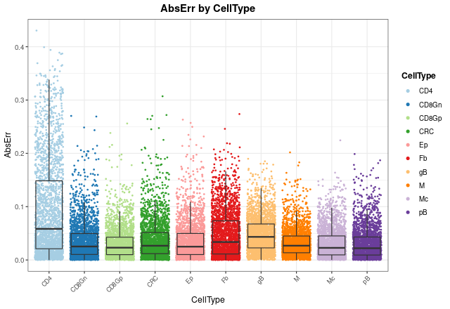

In order to see the mean error values, we can check it with `barErrorPlot`:


```r
barErrorPlot(DDLSLiComp, error = "MAE", by = "CellType")
```

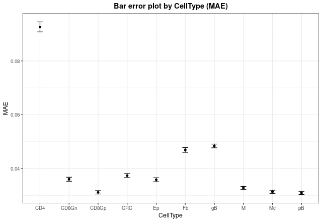


Now, we can see in which proportions the model is failing more by changing the `x.by` argument to `"pBin"` and optionally setting `facet.by = "CellType"`:


```r
distErrorPlot(
  DDLSLiComp,
  x.by = "pBin",
  error = "AbsErr",
  color.by = "CellType", 
  type = "boxplot",
  size.point = 0.5
)
```

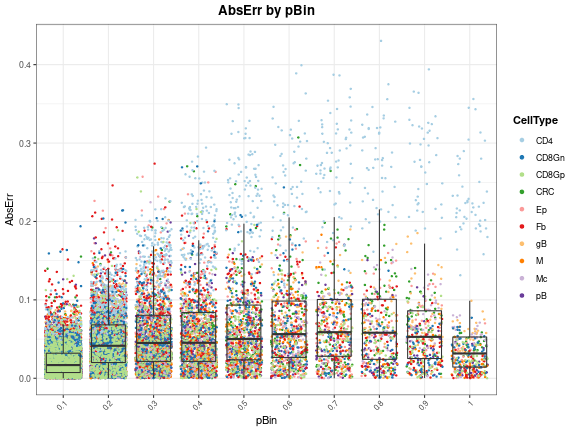


```r
distErrorPlot(
  DDLSLiComp,
  x.by = "pBin",
  error = "AbsErr",
  facet.by = "CellType",
  color.by = "CellType", 
  error.label = TRUE,
  type = "boxplot"
)
```

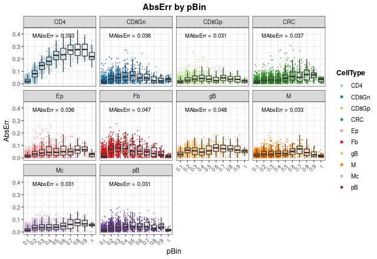


As can be seen, most of the failures in CD4 T cell proportions occurs at high proportions (between 0.5 and 1), and the mean absolute errors (`MAbsErr`) shown as annotations on each panel are very low in all the cases.

### Correlation between actual and expected proportions

Another way to visualize how the model works is to use the `corrExpPredPlot` function. Like `distErrorPlot`, we can see how the proportions are correlated by different variables. Here, we can see the same trend observed above: the model performs worse estimating CD4 T cell proportions with the lowest concordance correlation and Pearson's coefficients ($R = 0.95$ and $CCC = 0.794$, respectively). In fact, we can observe that the model tends to under-estimate these proportions, although these values are still good. For the rest of cell types, the results show a very good performance with high coefficients (between 0.97 and 0.99).


```r
corrExpPredPlot(
  DDLSLiComp,
  color.by = "CellType",
  facet.by = "CellType",
  corr = "both", 
  size.point = 0.5
)
```

```
## `geom_smooth()` using formula 'y ~ x'
```

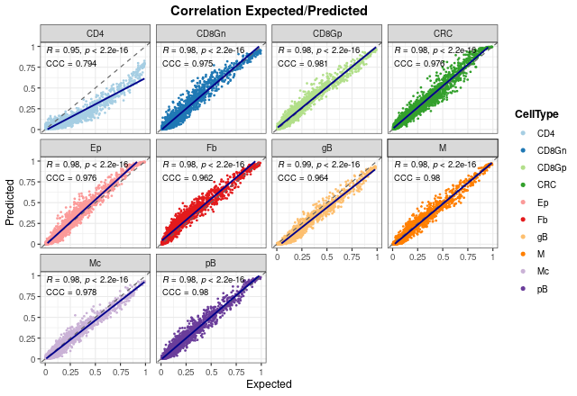

It is very important to note that these results only show the estimated proportions of pseudo-bulk samples. If we don't filter out single-cell profiles, the results improve in general, showing that the model is able to deal with pure samples as well.


```r
corrExpPredPlot(
  DDLSLiComp,
  color.by = "CellType",
  facet.by = "CellType",
  size.point = 0.5, 
  filter.sc = FALSE,
  corr = "both"
)
```

```
## `geom_smooth()` using formula 'y ~ x'
```

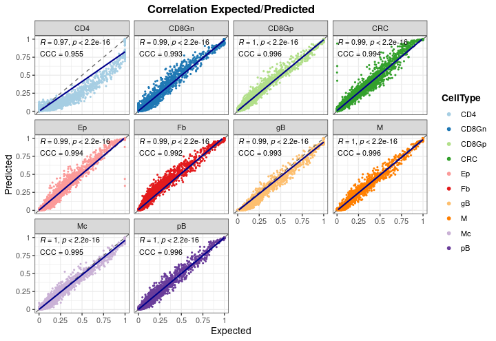


In the end, we can see the overall results without splitting the graph. As can be seen, both coefficients present also high values when all proportions are considered.


```r
corrExpPredPlot(
  DDLSLiComp,
  color.by = "CellType",
  size.point = 0.5,
  corr = "both"
)
```

```
## `geom_smooth()` using formula 'y ~ x'
```

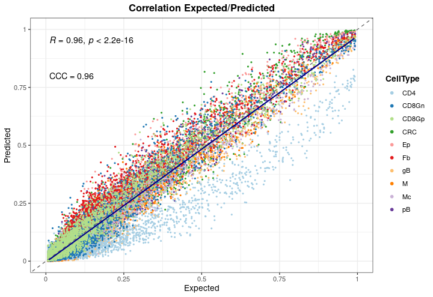


### Bland-Altman agreement plots

The last way to graphically represent results is to use `blandAltmanLehPlot`. It generates a Bland-Altman agreement plot, a method for analyzing the level of agreement between two variables, in that case expected vs predicted cell proportions. As shown, most of the proportions fall close to zero (note the blue density lines) and the dashed red lines are very close to the mean, although we can observe again the aforementioned problem in the estimate of T CD4 cell proportions. 


```r
blandAltmanLehPlot(
  DDLSLiComp, 
  color.by = "CellType",
  size.point = 0.5,
  filter.sc = TRUE,
  density = TRUE
)
```

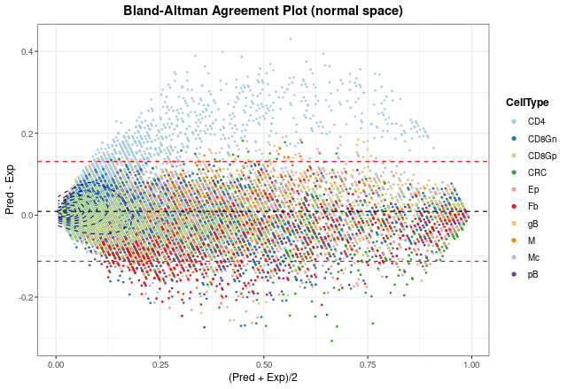

Finally, we can generate the same plot but spliting the information by the number of different cell types present in each pseudo-bulk sample. The smaller the number of cell types, the larger the error made by the model. In any case, considering the results from `distErrorPlot` and `corrExpPredPlot`, we can conclude that the model performs well on the test data.


```r
blandAltmanLehPlot(
  DDLSLiComp, 
  color.by = "nCellTypes",
  facet.by = "nCellTypes",
  log.2 = FALSE,
  size.point = 0.5,
  filter.sc = TRUE,
  density = FALSE
)
```

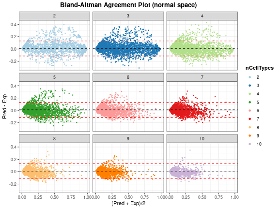


## **digitalDLSorteR** dealing with real data from TCGA project

Now, to show the performance of this model on real data, colorectal cancer samples from The Cancer Genome Atlas (TCGA) project [@Koboldt2012; @Ciriello2015] will be used. This dataset consists of 521 samples and includes different subtypes of tumors and healthy samples. 


```r
data(TCGA.colon.se)
TCGA.colon.se
```

```
## class: SummarizedExperiment 
## dim: 59085 521 
## metadata(0):
## assays(1): counts
## rownames(59085): 5S_RRNA 7SK ... ZZEF1 ZZZ3
## rowData names(0):
## colnames(521): X0096f6b3.94f5.49d9.aa43.66d9ab6b2b5c X01f5a228.a2cf.444f.8102.a9d4a2d9a27d ... ff016e44.7a4d.4423.822e.aa6aa6df0ef2 ffbe7115.06be.4592.91d0.3dad62e3c73a
## colData names(2): Bulk Tumor_Type
```

As shown in [Building new deconvolution models](newModels.html), we can load the data into the `DigitalDLSorter` object as follows:


```r
DDLSLiComp <- loadDeconvData(
  object = DDLSLiComp,
  data = TCGA.colon.se, 
  name.data = "TCGA.colon"
)
```

Then, with the `deconvDigitalDLSorterObj` function, these new samples can be deconvoluted into the cell types considered by the model and the predicted proportions can be represented by the `barPlotCellTypes` function. 


```r
DDLSLiComp <- deconvDigitalDLSorterObj(
  object = DDLSLiComp, 
  name.data = "TCGA.colon",
  verbose = FALSE
)
barPlotCellTypes(DDLSLiComp,  name.data = "TCGA.colon", rm.x.text = TRUE)
```

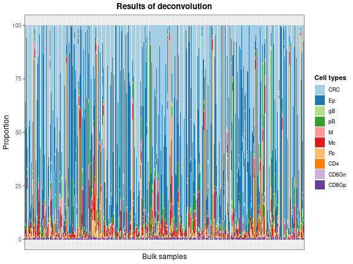

As the total number of samples is too high, we can see the results of some samples by taking the matrix with the proportions and plotting 20 random samples with `barPlotCellTypes`:


```r
set.seed(12345)
resDeconvTCGA <- deconv.results(DDLSLiComp, "TCGA.colon")
barPlotCellTypes(
  resDeconvTCGA[sample(1:521, size = 20), ], rm.x.text = TRUE,
  title = "Results of deconvolution (20 random samples)"
)
```

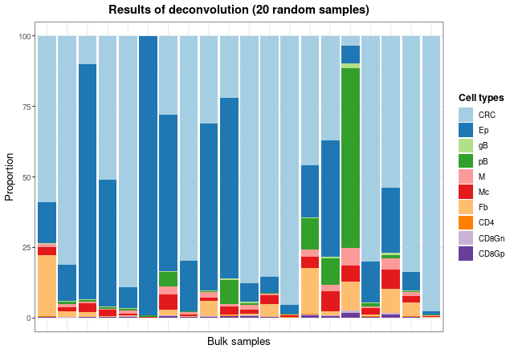

Finally, to check whether the predicted estimates make sense with the type of sample they come from (metastatic, normal, primary and recurrent), we will inspect the predicted proportions of tumor cells, epithelial cells and fibroblasts.


```r
dfProp <- data.frame(
  Sample = rownames(resDeconvTCGA),
  CRC = resDeconvTCGA[, "CRC"],
  Ep = resDeconvTCGA[, "Ep"],
  Fb = resDeconvTCGA[, "Fb"],
  TypeSample = TCGA.colon.se@colData$Tumor_Type
)
dfProp <- reshape2::melt(dfProp)
```

```
## Using Sample, TypeSample as id variables
```

```r
ggplot(dfProp, aes(x = TypeSample, y = value, fill = TypeSample)) +
  geom_boxplot() + facet_wrap(~ variable) + ylab("Estimated proportion") + 
  ggtitle("Estimated proportions in TCGA data") + theme_bw() + 
  theme(
    plot.title = element_text(face = "bold", hjust = 0.5),
    legend.title = element_text(face = "bold")
  )
```

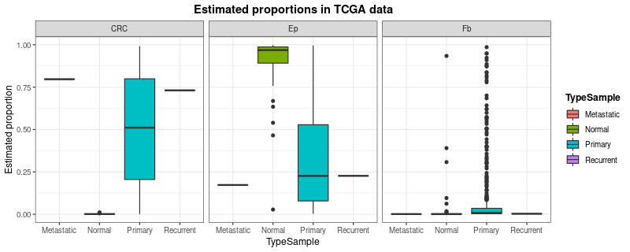

**digitalDLSorteR** correctly estimates the proportion of tumor cells (`CRC`) and epithelial/fibroblast cells (`Ep` and `Fb`) according to sample type. Further analysis can be performed to better understand and evaluate the performance of the model on these data (correlation analysis between estimated cell proportions, comparisons with other published tools, etc.).

## References
