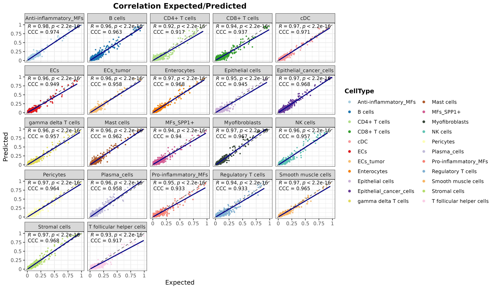
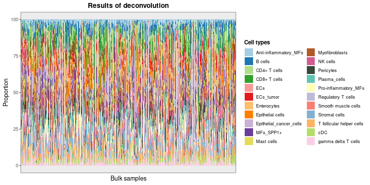
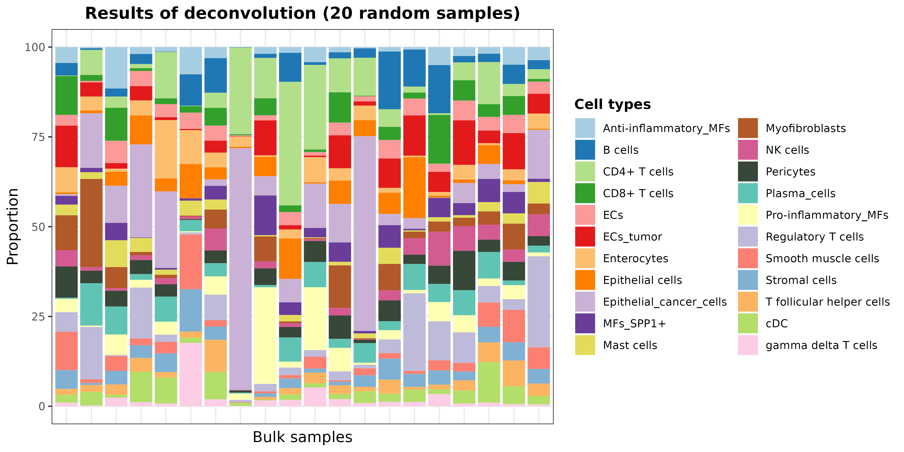
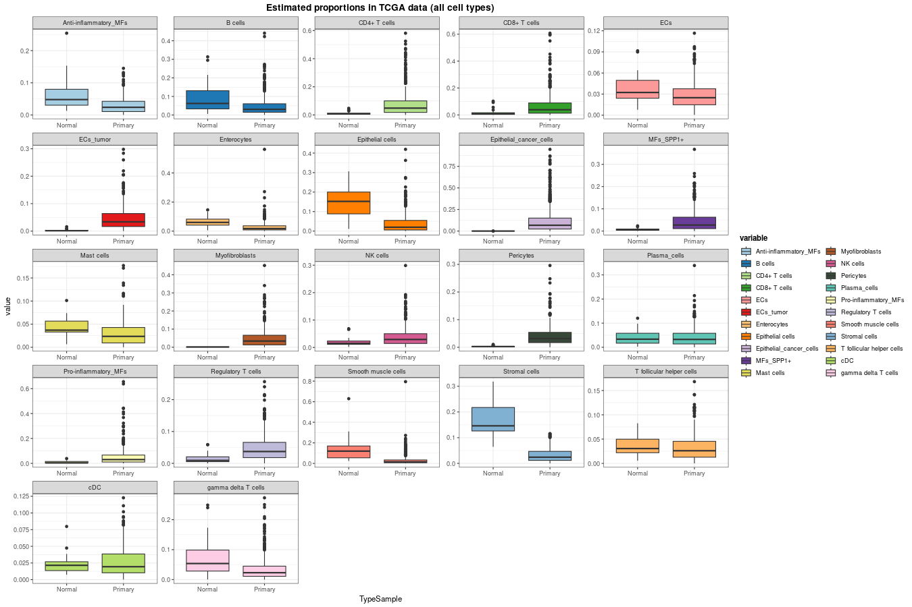
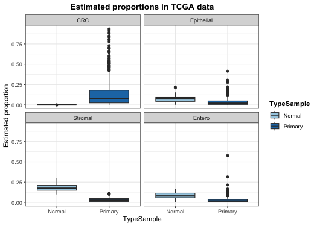
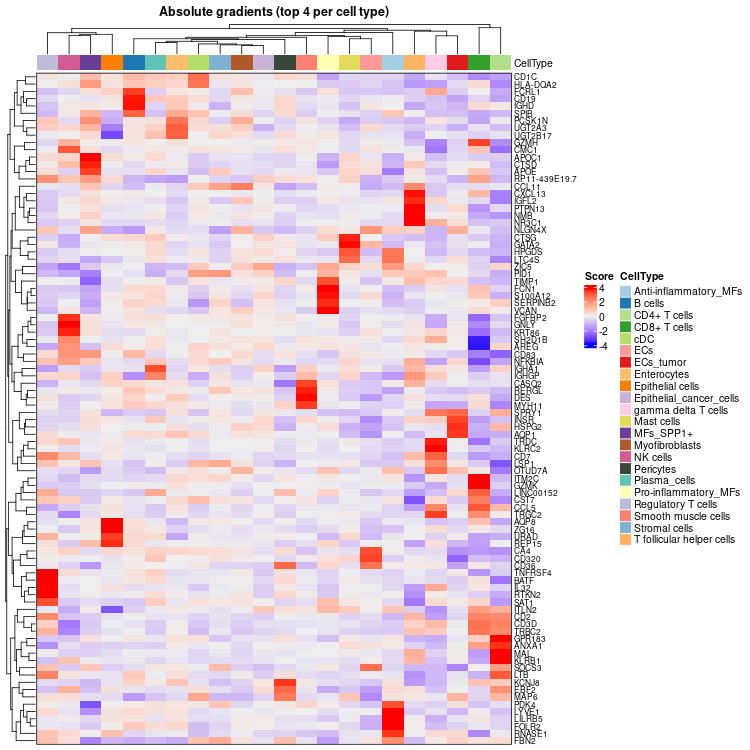

In this example, we are going to reproduce the pre-trained model `DDLS.colon.lee` available at the **digitalDLSorteRmodels** R package. It was trained on data from @Lee2020 ([GSE132465](https://www.ncbi.nlm.nih.gov/geo/query/acc.cgi?acc=GSE132465), [GSE132257](https://www.ncbi.nlm.nih.gov/geo/query/acc.cgi?acc=GSE132257) and [GSE144735](https://www.ncbi.nlm.nih.gov/geo/query/acc.cgi?acc=GSE144735)), and consist of ~ 100,000 cells from a total of 31 patients including tumoral and healthy samples. These cells are divided into 22 cell types covering the main ones found in this kind of samples: `Anti-inflammatory_MFs` (macrophages), `B cells`, `CD4+ T cells`, `CD8+ T cells`, `ECs` (endothelial cells), `ECs_tumor`, `Enterocytes`, `Epithelial cells`, `Epithelial_cancer_cells`, `MFs_SPP1+`, `Mast cells`, `Myofibroblasts`, `NK cells`, `Pericytes`, `Plasma_cells`, `Pro-inflammatory_MFs`, `Regulatory T cells`, `Smooth muscle cells`, `Stromal cells`, `T follicular helper cells`, `cDC` (conventional dendritic cells), and `gamma delta T cells`. The expression matrix only contains 2,000 genes selected by **digitalDLSorteR** when the model was created to save time and RAM. Thus, in this example we will set the parameters related to gene filtering to zero. 


``` r
suppressMessages(library("SummarizedExperiment"))
suppressMessages(library("SingleCellExperiment"))
suppressMessages(library("digitalDLSorteR"))
suppressMessages(library("ggplot2"))
suppressMessages(library("dplyr"))

if (!requireNamespace("digitalDLSorteRdata", quietly = TRUE)) {
  remotes::install_github("diegommcc/digitalDLSorteRdata")
}
suppressMessages(library("digitalDLSorteRdata"))
suppressMessages(library("dplyr"))
suppressMessages(library("ggplot2"))
```

## Loading data

We are also going to load bulk RNA-seq data on colorectal cancer patients from the The Cancer Genome Atlas (TCGA) program [@Koboldt2012; @Ciriello2015]. When building new deconvolution models, we recommend loading both the single-cell RNA-seq reference and the bulk RNA-seq dataset to be deconvoluted at the beginning so that **digitalDLSorteR** can choose only those genes that are actually relevant for the both of them. 


``` r
data("SCE.colon.Lee")
data("TCGA.colon.se")
# to make it suitable for digitalDLSorteR
rowData(TCGA.colon.se) <- DataFrame(SYMBOL = rownames(TCGA.colon.se))
```


``` r
DDLS.colon <- createDDLSobject(
  sc.data = SCE.colon.Lee,
  sc.cell.ID.column = "Index",
  sc.gene.ID.column = "SYMBOL",
  sc.cell.type.column = "Cell_type_6",
  bulk.data = TCGA.colon.se,
  bulk.sample.ID.column = "Bulk",
  bulk.gene.ID.column <- "SYMBOL",
  filter.mt.genes = "^MT-",
  sc.filt.genes.cluster = FALSE,
  sc.log.FC = FALSE,
  sc.min.counts = 0,
  sc.min.cells = 0,
  verbose = TRUE, 
  project = "Colon-Cancer-Project"  
)
```

```
## === Processing bulk transcriptomics data
```

```
##       - Removing 2568 genes without expression in any cell
```

```
##       - Filtering features:
```

```
##          - Selected features: 54918
```

```
##          - Discarded features: 1599
```

```
## 
```

```
## === Processing single-cell data
```

```
##       - Filtering features:
```

```
##          - Selected features: 2000
```

```
##          - Discarded features: 0
```

```
## 
## === No mitochondrial genes were found by using ^MT- as regrex
```

```
## 
## === Final number of dimensions for further analyses: 2000
```

After loading the data, we have a `DigitalDLSorter` object with 2,000 genes and both the single-cell RNA-seq used as reference and the bulk RNA-seq data to be deconvoluted. 


``` r
DDLS.colon
```

```
## An object of class DigitalDLSorter 
## Real single-cell profiles:
##   2000 features and 106364 cells
##   rownames: RP1-276N6.2 RILPL1 SERPINA5 ... SERPINA5 LGMN CXCL11 PLA2G5 
##   colnames: SMC07-T_AGCATACGTGTGCCTG SMC22-T_CACACAATCCACGAAT SMC24-T_CACATTTAGCAGGCTA ... SMC24-T_CACATTTAGCAGGCTA SMC16-T_GTAGGCCTCGCCTGTT SMC03-N_CCATGTCAGAATTGTG SMC08-T_ACAGCCGAGTTGTCGT 
## Bulk samples to deconvolute:
##   Bulk.DT bulk samples:
##     2000 features and 521 samples
##     rownames: NACAD NRXN1 FAM81A ... FAM81A COL3A1 RGS5 AURKC 
##     colnames: dc38ba64.6240.4bab.9ad5.2adb67e1b79e eb843ddf.f91d.4f04.b34c.549b1f53ee92 cf7ced35.7e29.4bdc.92e7.b56c315c54eb ... cf7ced35.7e29.4bdc.92e7.b56c315c54eb X3b8d04cd.d658.46ba.adca.079fee531e17 X574a3ef3.ea84.45f4.b20d.8b3d2b172793 X789c1767.4073.4ffa.b193.54b20b96d55e 
## Project: Colon-Cancer-Project
```

## Generating cell composition matrix

Now, let's generate the cell composition matrix by using the `generateBulkCellMatrix` function. It requires a data frame with prior knowledge about how likely is to find each cell type in a sample. For this example, we have used an approximation based on the frequency of each cell type in each patient/sample from the scRNA-seq dataset: 


``` r
prop.design <- single.cell.real(DDLS.colon)@colData %>% as.data.frame() %>% 
  group_by(Patient, Cell_type_6) %>% summarize(Total = n()) %>% 
  mutate(Prop = (Total / sum(Total)) * 100) %>% group_by(Cell_type_6) %>% 
  summarise(Prop_Mean = ceiling(mean(Prop)), Prop_SD = ceiling(sd(Prop))) %>% 
  mutate(
    from = Prop_Mean, 
    to.1 = Prop_Mean * (Prop_SD * 2),
    to = ifelse(to.1 > 100, 100, to.1),
    to.1 = NULL, Prop_Mean = NULL, Prop_SD = NULL
  )
```

```
## `summarise()` has grouped output by 'Patient'. You can override using the `.groups` argument.
```

Then, we can generate the actual pseudobulk samples that will follow these cell proportions. In this case, we generate 10,000 pseudobulk samples (`num.bulk.samples`), although this number could be increased according to available computational resources. 


``` r
## for reproducibility
set.seed(123)
DDLS.colon <- generateBulkCellMatrix(
  object = DDLS.colon,
  cell.ID.column = "Index",
  cell.type.column = "Cell_type_6",
  prob.design = prop.design,
  num.bulk.samples = 10000,
  verbose = TRUE
) %>% simBulkProfiles(threads = 2)
```

```
## 
## === The number of bulk RNA-Seq samples that will be generated is equal to 10000
```

```
## 
## === Training set cells by type:
```

```
##     - Anti-inflammatory_MFs: 501
##     - B cells: 7336
##     - CD4+ T cells: 10595
##     - CD8+ T cells: 7570
##     - cDC: 481
##     - ECs: 874
##     - ECs_tumor: 1398
##     - Enterocytes: 920
##     - Epithelial cells: 1411
##     - Epithelial_cancer_cells: 19447
##     - gamma delta T cells: 1459
##     - Mast cells: 499
##     - MFs_SPP1+: 4118
##     - Myofibroblasts: 1789
##     - NK cells: 1056
##     - Pericytes: 677
##     - Plasma_cells: 6259
##     - Pro-inflammatory_MFs: 2342
##     - Regulatory T cells: 4233
##     - Smooth muscle cells: 614
##     - Stromal cells: 5555
##     - T follicular helper cells: 639
```

```
## === Test set cells by type:
```

```
##     - Anti-inflammatory_MFs: 155
##     - B cells: 2456
##     - CD4+ T cells: 3515
##     - CD8+ T cells: 2583
##     - cDC: 163
##     - ECs: 336
##     - ECs_tumor: 431
##     - Enterocytes: 347
##     - Epithelial cells: 439
##     - Epithelial_cancer_cells: 6400
##     - gamma delta T cells: 499
##     - Mast cells: 175
##     - MFs_SPP1+: 1406
##     - Myofibroblasts: 592
##     - NK cells: 325
##     - Pericytes: 206
##     - Plasma_cells: 2075
##     - Pro-inflammatory_MFs: 761
##     - Regulatory T cells: 1467
##     - Smooth muscle cells: 191
##     - Stromal cells: 1829
##     - T follicular helper cells: 240
```

```
## === Probability matrix for training data:
```

```
##     - Bulk RNA-Seq samples: 7500
##     - Cell types: 22
```

```
## === Probability matrix for test data:
```

```
##     - Bulk RNA-Seq samples: 2500
##     - Cell types: 22
```

```
## DONE
```

```
## === Setting parallel environment to 2 thread(s)
```

```
## 
## === Generating train bulk samples:
```

```
## 
## === Generating test bulk samples:
```

```
## 
## DONE
```

## Neural network training

After generating the pseudobulk samples, we can train and evaluate the model. The training step is only performed using cells/pseudobulk samples coming from the training subset, since the test subset will be used for the assessment of its performance.  


``` r
DDLS.colon <- trainDDLSModel(object = DDLS.colon, verbose = FALSE)
```

```
## 
 1/79 [..............................] - ETA: 3s - loss: 0.1169 - accuracy: 0.7500 - mean_absolute_error: 0.0116 - categorical_accuracy: 0.7500
79/79 [==============================] - 0s 500us/step - loss: 0.1221 - accuracy: 0.7056 - mean_absolute_error: 0.0133 - categorical_accuracy: 0.7056
## 
79/79 [==============================] - 0s 503us/step - loss: 0.1221 - accuracy: 0.7056 - mean_absolute_error: 0.0133 - categorical_accuracy: 0.7056
```

## Evaluation of the model on test data

Once the model is trained, we can explore how well the model behaves on test samples. This step is critical because it allows us to assess if **digitalDLSorteR** is actually understanding the signals coming from each cell type or if on the contrary there are cell types being ignored. 


``` r
DDLS.colon <- calculateEvalMetrics(object = DDLS.colon)
```

**digitalDLSorteR** implements different functions to visualize the results and explore potential biases on the models. For this tutorial, we will check the correlation between expected and predicted proportions, but for a more detailed explanation about other visualization functions, check the Documentation. 


``` r
corrExpPredPlot(
  DDLS.colon,
  color.by = "CellType",
  facet.by = "CellType",
  corr = "both", 
  size.point = 0.5
)
```

```
## `geom_smooth()` using formula = 'y ~ x'
```

<div class="figure" style="text-align: center">

<p class="caption">plot of chunk corr1_realModelWorkflow</p>
</div>

As it can be seen, the model is accurately predicting the cell proportions of pseudobulk samples from the test data, which means that it is detecting differential signals for each cell type. 

## Deconvolution of TCGA samples

Now, to show its performance on real data, we are going to deconvolute the samples from the TCGA project [@Koboldt2012; @Ciriello2015] loaded at the beginning of the vignette. This dataset consists of 521 samples and includes both tumoral and healthy samples. This step is performed by the `deconvDDLSObj` function, which will use the trained model to obtain a set of predicted proportions for each sample contained in the `deconv.data` slot. 


``` r
DDLS.colon <- deconvDDLSObj(object = DDLS.colon, verbose = FALSE)
```

```
##    No 'name.data' provided. Using the first dataset
```

We can plot the results as follows: 


``` r
barPlotCellTypes(DDLS.colon, rm.x.text = TRUE)
```

```
## 'name.data' not provided. By default, first results are used
```

<div class="figure" style="text-align: center">

<p class="caption">plot of chunk barPlotResults_realModelWorkflow</p>
</div>

As the total number of samples is too high, we can see the results of some samples by taking the predicted cell proportions and plotting 20 random samples with `barPlotCellTypes`:


``` r
set.seed(12345)
resDeconvTCGA <- deconv.results(DDLS.colon, name.data = "Bulk.DT")
barPlotCellTypes(
  resDeconvTCGA[sample(1:521, size = 20), ], rm.x.text = TRUE,
  title = "Results of deconvolution (20 random samples)"
)
```

<div class="figure" style="text-align: center">

<p class="caption">plot of chunk barPlotResults20_realModelWorkflow</p>
</div>

Now, we can represent the cell proportions of every cell type considered by the model separating healthy and tumoral samples. We are also going to filter out samples considered metastatic or recurrent (check the `TCGA.colon.se` object) because these groups are composed of only 1 sample: 


``` r
data.frame(
  Sample = rownames(resDeconvTCGA),
  TypeSample = colData(TCGA.colon.se)[["Tumor_Type"]]
) %>% cbind(resDeconvTCGA) %>% 
  reshape2::melt() %>% filter(!TypeSample %in% c("Metastatic", "Recurrent")) %>% 
  ggplot(aes(x = TypeSample, y = value, fill = variable)) + 
  geom_boxplot() + facet_wrap(~ variable, scales = "free") + 
  scale_fill_manual(values = digitalDLSorteR:::default.colors()) + 
  ggtitle("Estimated proportions in TCGA data (all cell types)") + theme_bw() + 
    theme(
      plot.title = element_text(face = "bold", hjust = 0.5),
      legend.title = element_text(face = "bold")
    )
```

```
## Using Sample, TypeSample as id variables
```

<div class="figure" style="text-align: center">

<p class="caption">plot of chunk boxplotResults_realModelWorkflow</p>
</div>

In general, the results seem to be in line with what it is known: tumoral samples show a huge immune infiltration, whereas other cell types such as epithelial cells are displaced. We can also specifically inspect the predicted proportions of enterocytes, tumor, epithelial, and stromal cells: 


``` r
data.frame(
  Sample = rownames(resDeconvTCGA),
  CRC = resDeconvTCGA[, "Epithelial_cancer_cells"],
  Epithelial = resDeconvTCGA[, "Epithelial cells"],
  Stromal = resDeconvTCGA[, "Stromal cells"],
  Entero = resDeconvTCGA[, "Enterocytes"],
  TypeSample = TCGA.colon.se@colData$Tumor_Type
) %>% filter(!TypeSample %in% c("Metastatic", "Recurrent")) %>% 
  reshape2::melt() %>% 
  ggplot(aes(x = TypeSample, y = value, fill = TypeSample)) +
    geom_boxplot() + facet_wrap(~ variable) + ylab("Estimated proportion") + 
  scale_fill_manual(values = digitalDLSorteR:::default.colors()) + 
    ggtitle("Estimated proportions in TCGA data") + theme_bw() + 
    theme(
      plot.title = element_text(face = "bold", hjust = 0.5),
      legend.title = element_text(face = "bold")
    )
```

```
## Using Sample, TypeSample as id variables
```

<div class="figure" style="text-align: center">

<p class="caption">plot of chunk boxplotResults_2_realModelWorkflow</p>
</div>
As it can be seen, **digitalDLSorteR** correctly estimates the absence of tumor cells (`CRC`) in healthy samples. On the other hand, the predicted proportion of enterocytes, epithelial and stromal cells decrease in the tumoral samples, which makes sense considering the infiltration of immune cells and the increased presence of tumoral cells. 

## Interpreting the neural network model 

Finally, we have implemented a way to make the predictions made by  **digitalDLSorteR** more interpretable. This part was developed for our new R package for deconvolution of spatial transcriptomics data [**SpatialDDLS**](https://diegommcc.github.io/SpatialDDLS/index.html), and the methodology is explained in @Mananes2024. 


``` r
DDLS.colon <- interGradientsDL(DDLS.colon)
```

We can explore the top 5 genes with the highest gradient for each cell type to check which genes are being more used by the model: 


``` r
top.gradients <- topGradientsCellType(
  DDLS.colon, method = "class", top.n.genes = 5
)
sapply(
  top.gradients, \(x) x$Positive
) %>% as.data.frame()
```

```
##   Anti-inflammatory_MFs B cells CD4+ T cells CD8+ T cells     ECs ECs_tumor Enterocytes
## 1                 LYVE1    IGHD        KLRB1         GZMK   FABP5      INSR     UGT2B17
## 2                  PLTP    CD19        ANXA1         GZMH   SOCS3      AQP1       ITM2C
## 3                 FOLR2   FCRL1       GPR183        ITM2C    CD36     HSPG2      UGT2A3
## 4                  PDK4    PAX5          MAL        VCAM1   CD320    IGFBP5      PCSK1N
## 5                RNASE1    CD83          LTB         NKG7 SLC14A1    FKBP1A       MYOM1
##   Epithelial cells Epithelial_cancer_cells      MFs_SPP1+ Mast cells Myofibroblasts NK cells
## 1             ZG16                    AREG           CTSD      ANXA1         LGALS1   FGFBP2
## 2             AQP8                    PLTP          APOC1      GATA2  RP11-400N13.3     CMC1
## 3             URAD                     EN2 RP11-1008C21.1       CTSG          ITM2C     GNLY
## 4             TFF3                    CTSH          GPNMB        VIM          IGFL2    KRT86
## 5            REP15                   GSTP1           APOE       LMNA    RP11-54O7.3    KLRC1
##   Pericytes Plasma_cells Pro-inflammatory_MFs Regulatory T cells Smooth muscle cells Stromal cells
## 1      CD36    LINC00152                 FCN1               BATF               RERGL         EPHA7
## 2 LINC00152         RGS1              S100A12              RTKN2               CASQ2         FCGRT
## 3      MAP6        IGHA1                TIMP1            TNFRSF4                 DES            C7
## 4    RNF152     IGHV4-61                IL1RN               IL32                SNCG        SEMA3E
## 5     CNTN4         SRGN             SERPINB2                LTB               RBM24         ZFP36
##   T follicular helper cells      cDC gamma delta T cells
## 1                    CXCL13 HLA-DQA2               KLRC2
## 2                     NR3C1   INSIG1               TRGC2
## 3                       NMB     CST7                TRDC
## 4                    PTPN13     CD1C                CCL5
## 5                      SRGN     ENHO                GZMA
```

In addition, **digitalDLSorteR** also implements a function to plot the top gradients per cell type as a heatmap: 


``` r
hh <- plotHeatmapGradsAgg(DDLS.colon, top.n.genes = 4, method = "class")
hh$Absolute
```

<div class="figure" style="text-align: center">

<p class="caption">plot of chunk heatmapGradients_realModelWorkflow</p>
</div>


It is important to note that these markers should not be interpreted as cell type markers. Rather, they serve as indications to help interpret the model’s performance. In addition, due to the multivariate nature of this approach, gradients are surrogates at the feature level for predictions made considering all input variables collectively, and thus caution should be exercised in drawing direct conclusions about specific gene-cell type relationships.

## References
